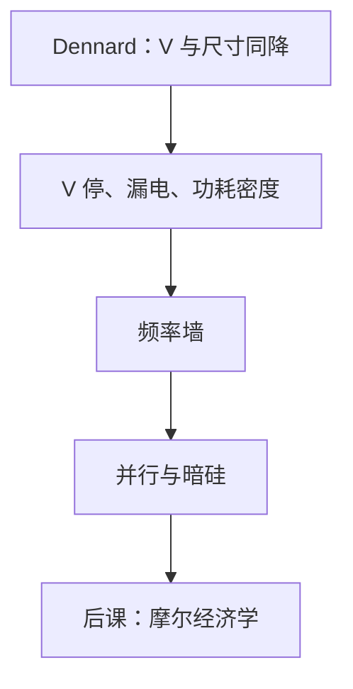

# 功耗墙与 Dennard 缩放

  
Dennard 缩放曾让电压与尺寸一起降，功耗密度近似不变；墙之后晶体管仍变多，瓦特不再跟面积成比例让出，频率停在墙上。

  <footer>—— 据 Dennard et al., Design of Ion-Implanted MOSFETs with Very Small Physical Dimensions, IEEE JSSC 1974；Hennessy and Patterson, CA:AQA 整理</footer>

[上一课](/cs/clock-gating-dvfs)给出门控与 DVFS。[动态与静态功耗](/cs/power-dynamic-static)写了 $CV^2f$。缺口是历史约束：**Dennard 缩放**为何曾允许每代升高 $f$，以及功耗墙如何逼出多核与暗硅——否则摩尔课只剩晶体管计数口号。

## 问题

Dennard 等 1974：线性尺寸 $1/k$，电压 $1/k$，则电场大致不变，延迟降、功耗/器件降，$k^2$ 倍密度下功耗密度近似恒定。缺口不是再推 $CV^2f$，而是：阈值电压不能按比例无限降（漏电指数上升），$V$ 降不动则 $CV^2f$ 在密度上升时把功耗密度顶破。频率不再每代自动涨，这就是功耗墙。

暗硅：同一时刻只能点亮部分芯片，否则无法散热。与把整片华莱士树每拍翻满相冲突——算术单元要可门控。

### 功耗墙不是「摩尔定律死了」

晶体管密度仍可增（下一课经济学与工艺节点），只是**性能/瓦**的旧公式断了。把两句话当成同一句，会既说错 Dennard 也说错 Moore。多核、加速器、近存计算是墙之后的体系结构回答，本课只钉物理来源。

Dennard et al., *IEEE JSSC*, 1974。Esmaeilzadeh 等关于暗硅的论述在体系结构文献中广泛引用；CA:AQA 有功耗与多核转折的教材叙述。本课不发明 arXiv 号。

## 方法

对照缩放表：理想 Dennard vs 后墙（$V$ 近停滞、$f$ 近停滞、$N$ 仍增）。设计含义：并行度换吞吐、加速专用单元（FMA 阵列）只在使用时点亮、DVFS 在负载曲线上爬。STA 的目标频率由热设计功耗（TDP）封顶，不是由组合逻辑能跑多快单独决定。

FPGA 同样受墙约束，LUT 翻转与静态漏电一起进 TDP。

## 机制

下一课把「能不能继续缩小」改写成成本、良率与设计费用，而不是电场。本课给体系结构的约束：CPI 再低，瓦特封顶则要降 $f$ 或关单元。验证测试向量的高翻转会超过功能 TDP，需要分模式。

## 边界

本课不推导短沟道效应全套方程，不预测某年之后的节点名。不把大模型训练集群的 MW 当成 Dennard 的反例展开。不进入光刻能否成像更小栅——那是光刻栏。

后课默认：Dennard 缩放已破，功耗密度限制同时点亮的逻辑；频率不是免费礼物。

## 小结

- Dennard：尺寸与电压同降，功耗密度近似不变。
- 墙：$V$ 与漏电，频率停，暗硅出现。
- 门控/DVFS/专用单元是墙后的工程回答。
- 出处：Dennard et al., *IEEE JSSC*, 1974；Hennessy and Patterson, CA:AQA。
