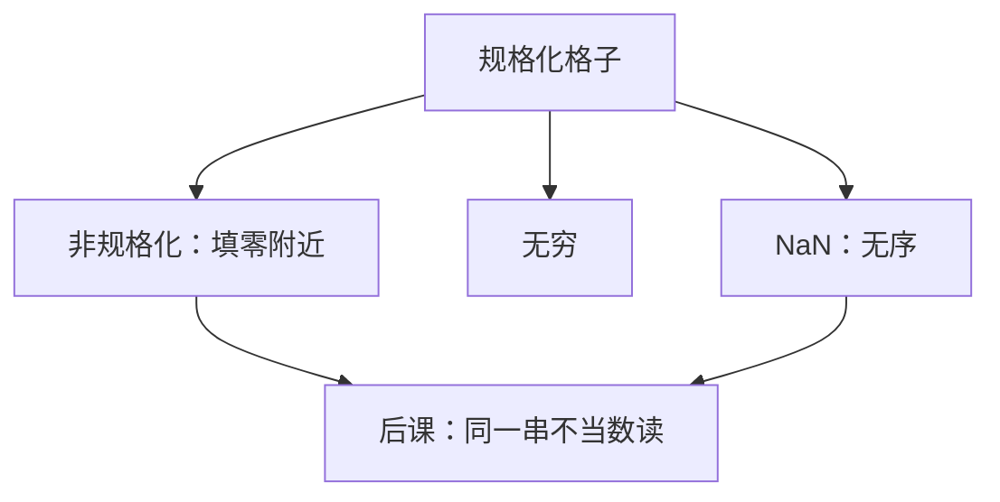

# 非规格化与 NaN

规格化格子在零前有一道悬崖；非规格化把台阶接着铺下去。NaN 则是「这不是一个数」的合法位型，不是溢出后的某个很大的整数。

<footer>—— 据 IEEE Std 754-2008；Goldberg, What Every Computer Scientist Should Know About Floating-Point Arithmetic, 1991 整理</footer>

上一课[舍入模式](/cs/rounding-modes)钉死了理想结果往格子哪一侧靠。[IEEE 754](/cs/ieee-754)已经标出指数全 $0$ / 全 $1$ 的槽位。本课不重讲偏置，也不从「异常处理」另起。缺口是：规格化最小正数以下，若直接跳到零，相对误差突然炸开；无效运算若仍交回某个有限数，后课分支会把「不是数」当成很大或很小。

## 问题

规格化要求隐藏首位为 $1$，最小正数是 $2^{1-\mathrm{bias}}$ 量级。再小的理想结果，若 flush-to-zero，就变成零——这是硬下溢。缺口之一是**渐近下溢**：指数全 $0$ 时改读 $0.f\times 2^{1-\mathrm{bias}}$，用显式尾数填零附近的洞，有效位数随幅值下降。

缺口之二：指数全 $1$、尾数非 $0$ 是 NaN。比较无序；加法传播 NaN。上一课的舍入假定结果仍是实数邻居；NaN 没有「最近的实数」。quiet / signaling 与载荷是 2008 写清的细节，本课只钉到够后课哈希与分支不踩坑。

### NaN 不是「出错的补码」

整数溢出仍是某个补码字。NaN 与任何有限值、与无穷的无序比较，不能用上一课有符号溢出旗标代替。把 NaN 当成 `INT_MAX`，排序和 `==` 都会错：NaN $\neq$ NaN 在 754 里是规定。

754-2008 把 subnormal 与 NaN 编码写进交换格式。Goldberg 用渐近下溢解释为什么零附近不要一道悬崖。Flush-to-zero 是实现加速选项，不是默认交换语义。

## 方法

指数全 $0$、尾数全 $0$：有符号零（上一课已区分比特与数值）。指数全 $0$、尾数非 $0$：非规格化。指数全 $1$、尾数全 $0$：$\pm\infty$。指数全 $1$、尾数非 $0$：NaN；最高尾数位通常区分 quiet 与 signaling。算术：非数参与则结果常为 qNaN；sNaN 参与则发 invalid。本课不把五类异常接到陷阱入口。

舍入仍适用：下溢时先谈精确结果再映射到非规格化或零。模式朝零时，很小的数更容易变成零。

## 机制

有了非规格化，交换位型在零附近连续到 $2^{1-\mathrm{bias}-p}$ 量级（$p$ 为尾数精度）。软浮点与部分 GPU 路径仍 flush-to-zero，结果不可与 754 默认逐比特比。NaN 载荷可携带诊断，但可移植代码不能依赖载荷值。后课文本编码开始后，浮点位型不再改；同一比特串改读字符是另一套约定。

## 边界

本课不讲十进制非规格化，不把 NaN boxing 当语言实现细节展开。字符、码位与数值无关，从[下一课](/cs/char-unicode)起换对象。

后课默认：单/双精度按 754 读；零附近有非规格化；NaN 无序且 $\mathrm{NaN}\neq\mathrm{NaN}$。

## 小结

- 非规格化填规格化最小正数与零之间的洞，精度下降。
- NaN 是合法位型，比较无序；不是补码溢出值。
- Flush-to-zero 会改变交换语义。
- 出处：IEEE 754-2008；Goldberg, 1991。
