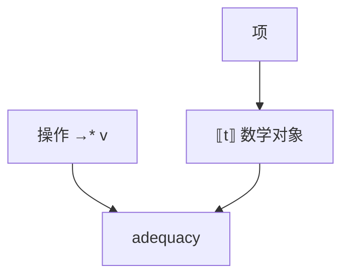

# 指称语义直觉

把项映射到数学对象：函数、域上的点、关系。组合性：复合项的含义由部件的含义算出。操作语义给步骤，指称给「是什么」。

<footer>—— 据 Scott 域论；Stoy, Denotational Semantics；Pierce TAPL 短论；Knaster–Tarski 课的延续整理</footer>

上一课[操作语义](/cs/operational-semantics)给出 $\to$。缺口是**指称**：$\llbracket t\rrbracket$ 是集合论或域里的元素，β 在指称里变成等式。递归要用最小不动点——[Knaster–Tarski](/cs/knaster-tarski-fixpoint) 已给格上的工具。本课直觉：为何需要域（不终止），不把完整域论作业写完。

## 问题

操作语义的「等价」是互模拟或上下文等价，难算。指称：两个项含义相同则应可替换（组合性保证合同）。缺口是**含义函数**，不是再列 SOS 规则。

不终止：朴素函数集没有 $\bot$。Scott：偏序、连续函数，$Y$ 是最小不动点。STLC 无递归则可用完全的集合论函数。

### 指称不是「编译到数学的编译器」

它是规范。编译器正确性：$\llbracket\mathrm{target}\rrbracket$ 与 $\llbracket\mathrm{source}\rrbracket$ 相关（后课 CompCert 用操作+模拟更多）。不要把指称当运行时。

Dana Scott。Stoy 的教材。Plotkin 的 ADEQUACY：指称与操作一致。本课不写幂域处理非确定的全文。

## 方法

STLC：$\llbracket\tau\to\tau'\rrbracket=\llbracket\tau\rrbracket\to\llbracket\tau'\rrbracket$，$\llbracket\lambda x.t\rrbracket$ 是函数。带递归：在域上取 $\mathrm{fix}$。命令式：状态变换器 $\mathrm{State}\to\mathrm{State}\times\mathrm{Val}$，或用单子。

与类型：含义可只给良型项定义，健全性变成「含义有定义」。

## 机制

完全抽象：指称相等 iff 上下文等价。PPL 里往往失败（序列化、并行），需精细模型。本课只要知道这是理想，不是免费定理。

不要用指称去「优化浮点」而不谈 IEEE——指称必须先选数学模型，fast-math 后课会破坏它。

## 边界

本课不证 Scott 定理。后课默认：含义可组合；递归靠不动点。下一课抽象解释：在格上近似指称/收集语义，服务分析。

也不把 UML 当指称语义。

## 小结

- 指称：项 → 数学对象，求组合性。
- 不终止与递归需要域与最小不动点。
- adequacy 把指称和操作对齐。
- 出处：Scott；Stoy；对照 Plotkin、Pierce；Knaster–Tarski。
