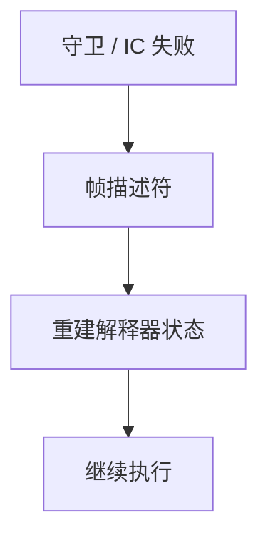

# 去优化

投机编译假设类型、别名、类层次；失败时必须把 native 帧翻译回解释器（或低层 JIT）状态，而不能假装没发生过。

<footer>—— 据 Hölzle, Chambers and Ungar, Debugging Optimized Code with Dynamic Deoptimization, 1992；HotSpot 去优化说明整理</footer>

上一课[内联缓存](/cs/inline-caching) 在失配时要退出投机码。缺口是 **deopt**：映射寄存器与 spill 到字节码栈、PC、锁状态。本课钉为什么必须、元数据，类型反馈下一课是投机的来源。

## 问题

内联+类型假设后，CFG 不再对应源方法。失败：类加载打破 CHA、IC 失配、守卫失败。必须恢复：解释器能继续。缺口是**栈重写与副作用已发生**（不能回滚 IO），只恢复虚拟机状态。

OSR（on-stack replacement）是反方向：解释器帧换成 compiled 帧。

### 去优化不是「反编译」

不是从机器码还原源。是编译器预先留下的映射表：`pc → 字节码索引 + 位置列表`。与 DWARF 同类，服务 VM 而非 GDB。

Hölzle et al. 1992 PLDI。HotSpot Deoptimization。本课不写全部帧描述符格式。

## 方法

编译时发 deopt 元数据。运行时：save 寄存器、walk 内联帧链、物化对象（逃逸分析撤销）、跳入解释器。延迟去优化：标记代码为非入口，现有帧在安全点再转。

与[逃逸分析](/cs/escape-analysis)：栈化对象在 deopt 时要重新堆分配（物化）。

## 机制

安全点：GC 与 deopt 只能在约定点停，否则映射不存在。不要在任意机器指令去优化。锁：膨胀、消除的锁要恢复。

性能：deopt 应稀。频繁则代码太投机，要降级。

## 边界

本课不写分层编译阈值。后课默认：投机必须可逆到 VM 状态。下一课类型反馈：给投机提供数据。

也不把 deopt 当异常 unwind 的别名（可共用展开，语义不同）。

## 小结

- 去优化：投机 native → 解释器/低层状态。
- 靠编译期映射，不是反编译。
- 物化、锁、安全点是实现难点。
- 出处：Hölzle, Chambers and Ungar, 1992；HotSpot。
