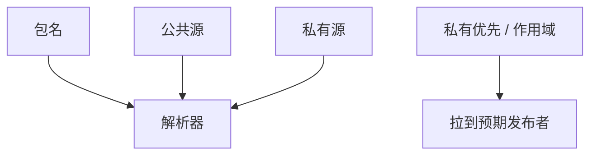

# 依赖混淆

包管理器按名字解析。内部包名若在公网可被同名抢注，构建可能拉到陌生人的版本。这是名字空间与源优先级问题，不是 AES 配错。

<footer>—— 据 Birsan 对依赖混淆的公开报告；对照 npm/PyPI 的命名空间与作用域政策</footer>

## 定位

上一课[SBOM](/cs/sbom-reproducible-builds)要你知道依赖是谁。缺口是**解析**：CI 可能先问公共登记。本课讲作用域、私有源优先、钉哈希，不提供抢注教程。

后课默认已经读完本课钉下的合同，只补差，不从该领域第一性原理重开。

## 问题

内部名 `company-logger` 未在公网占住，构建配置了公共源。解析器选了高版本的公共包。缺口是源策略与作用域（`@org/`）。

### 钉版本不够

要钉完整性哈希或供应商缓存。版本号可被抢先加。

Birsan 2021 公开报告。本课禁止对公共登记处的实验抢注。

## 方法

列防御：命名空间、私有代理只镜像允许列表、--offline、哈希锁文件。对照 typosquatting：看错字母。下一课安全编码与审计把人审接上。

图中节点是本课的机制骨架；课程不把图展开成可运行的攻击步骤。

## 机制

供应链的解析层与 DNS 课同形：名字到物件的映射可被骗。下一课把编码标准与代码审查收成流程。

前提写进合同之后，游戏外的误用只当失败模式点名，不在本课写成操作程序。

## 边界

本课无抢注步骤。安全编码与审计下一课。

## 小结

- SBOM 假设解析正确。
- 同名公共包可骗过 CI。
- 作用域、源优先级、哈希锁。
- 下一课安全编码与审计。
- 出处：Birsan, 依赖混淆公开报告；npm/PyPI 作用域文档。
