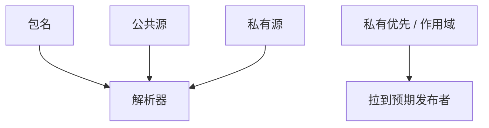
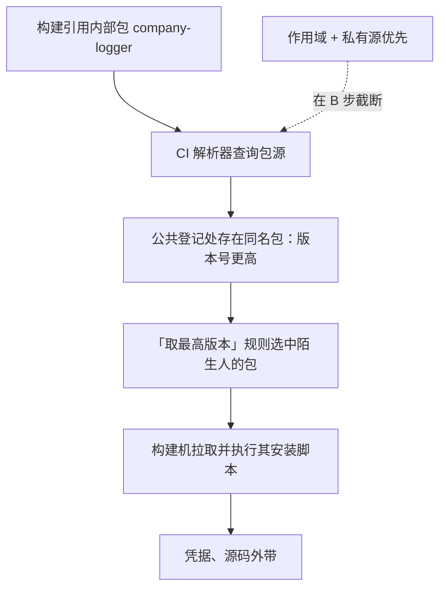

# 依赖混淆

包管理器按名字解析。内部包名若在公网可被同名抢注，构建可能拉到陌生人的版本。这是名字空间与源优先级问题，不是 AES 配错。

<footer>—— 据 Birsan 对依赖混淆的公开报告；对照 npm/PyPI 的命名空间与作用域政策</footer>

上一课[SBOM](/cs/sbom-reproducible-builds)要你知道依赖是谁。缺口是**解析**：CI 可能先问公共登记。本课讲作用域、私有源优先、钉哈希，不提供抢注教程。

后课默认已经读完本课钉下的合同，只补差，不从该领域第一性原理重开。

## 问题

内部名 `company-logger` 未在公网占住，构建配置了公共源。解析器选了高版本的公共包。缺口是源策略与作用域（`@org/`）。

直觉类比：依赖混淆像快递分拣只看收件人姓名、不看内部工号——你给同事「小李」寄文件，恰好小区外也住个「小李」，分拣系统「先查公共通讯录」就把文件送到了外人手里；对方还能把门牌号写得更醒目（版本号更高），让系统优先选他。

### 钉版本不够

要钉完整性哈希或供应商缓存。版本号可被抢先加。

Birsan 2021 公开报告。本课禁止对公共登记处的实验抢注。

## 方法

列防御：命名空间、私有代理只镜像允许列表、--offline、哈希锁文件。对照 typosquatting：看错字母。下一课安全编码与审计把人审接上。

```mermaid
flowchart TD
  NAME["包名"] --> RES["解析器"]
  PUB["公共源"] --> RES
  PRIV["私有源"] --> RES
  POL["私有优先 / 作用域"] --> SAFE["拉到预期发布者"]
```

## 机制

供应链的解析层与 DNS 课同形：名字到物件的映射可被骗。下一课把编码标准与代码审查收成流程。

把一次典型混淆攻击的链条拆开看，每一步都有对应的断点：

```mermaid
flowchart TD
  A["构建引用内部包 company-logger"] --> B["CI 解析器查询包源"]
  B --> C["公共登记处存在同名包：版本号更高"]
  C --> D["「取最高版本」规则选中陌生人的包"]
  D --> E["构建机拉取并执行其安装脚本"]
  E --> F["凭据、源码外带"]
  POL["作用域 + 私有源优先"] -.在 B 步截断.-> B
```

术语翻译：「作用域」就是给包名加姓氏，如 npm 的 `@org/logger`——`@org` 这个名字空间注册后归你所有，公网无人能用同一个全名抢注。没有前缀的裸名字（如 `company-logger`）才是人人可占的公共名，这正是混淆发生的地界。

常见误区：初学者以为在锁文件里钉死版本号就安全了。版本号只是发布者自报的字符串，攻击者完全可以发一个 9.9.9 的同名包，让「取最高版本」的规则选中它；真正兜底的是钉完整性哈希或私有代理只镜像允许列表——哈希对不上，直接拒绝安装。

## 边界

本课无抢注步骤。安全编码与审计下一课。

## 小结

- SBOM 假设解析正确。
- 同名公共包可骗过 CI。
- 作用域、源优先级、哈希锁。
- 下一课安全编码与审计。
- 出处：Birsan, 依赖混淆公开报告；npm/PyPI 作用域文档。
