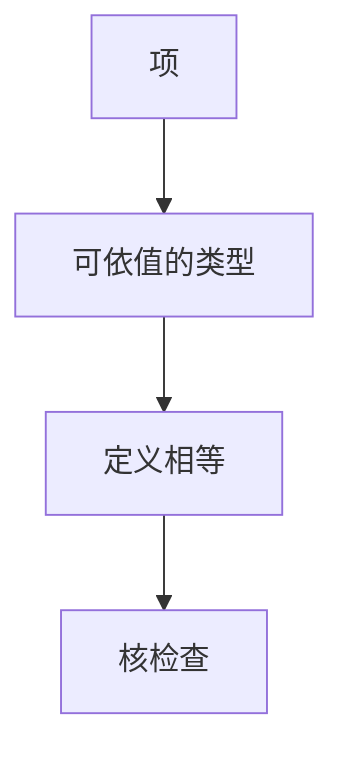

# 依值类型直觉

类型可以提到值：长度为 $n$ 的向量、等于证明。判断仍是 $\Gamma\vdash t:\tau$，但 $\tau$ 里有项。核检查，人不手写全部归约。

<footer>—— 据 Martin-Löf 类型论；Pierce TAPL 对依值类型的导引；[证明助手](/cs/proof-assistants)课的延续整理</footer>

上一课[穷尽性](/cs/exhaustiveness-check)在闭 ADT 上找反例。缺口是更强的索引：`Vec A n` 的 `cons` 把 $n$ 变成 $n+1$，匹配 `nil` 时 $n$ 必须是 $0$。计算理论补层的[证明助手](/cs/proof-assistants)已给 Curry–Howard 直觉；本课从**编程语言类型系统**再接一次：依值如何改变检查算法，而不是再讲 tactic。不重写 STLC 的箭头规则，只加 Π。

## 问题

HM 的 $\forall\alpha$ 量化类型，不量化自然数项。依值：$\Pi n:\mathbb{N}.\,\mathrm{Vec}\,A\,n \to \ldots$。应用时 $n$ 是项，须比较类型时做定义等式（$1+1 = 2$）。缺口是**类型里的计算**，不是宏展开。

可判定性：若允许任意递归函数出现在类型里，相等不可判定。助手限制终止；语言（Idris、Lean 作 PL）同样要终止或推迟。

### 依值不是「运行时把类型当值随便改」

阶段仍可擦除证明部分。运行时不必留下 $n$ 的证明项。与渐进类型的 `Any` 不同：这里多的是静态等式，不是动态 tag。

Martin-Löf。Howard。The Univalent Foundations Program 的 HoTT 书不在本课展开。Pierce 有依值导引。本课不进宇宙层级细节，证明助手课已点名。

## 方法

核心：Π、Σ、归纳族。检查：转换规则——若 $t:A$ 且 $A\equiv B$ 则 $t:B$。实现：规范化类型再比（或用等价算法）。编程：长度索引的 `append` 类型里写出加法。

与[算法 W](/cs/hindley-milner-w)：依值推断一般不可全自动，故双向检查（合成/检验）是实用算法，点名。

## 机制

抽取：证明擦掉，剩下计算。与 STLC 规范化对照：依值语言若允许非终止，逻辑可塌；作 PL 用时人选择是否要逻辑一致性。

不要把 `Vec` 当运行时每次检查长度的列表包装还称为依值；那是断言，不是 Π。

## 边界

本课不写 CIC 全部规则。后课默认：类型可依赖值；相等要计算。下一课线性类型：另一轴——用几次，而不是依赖哪个 $n$。

也不把 TypeScript 的条件类型当 Martin-Löf。

## 小结

- 依值：Π 让类型提到项；检查含定义相等。
- 终止限制换可判定核。
- 与 HM 量化、与动态 tag 都不同。
- 出处：Martin-Löf；Howard；Pierce TAPL；对照证明助手课。
