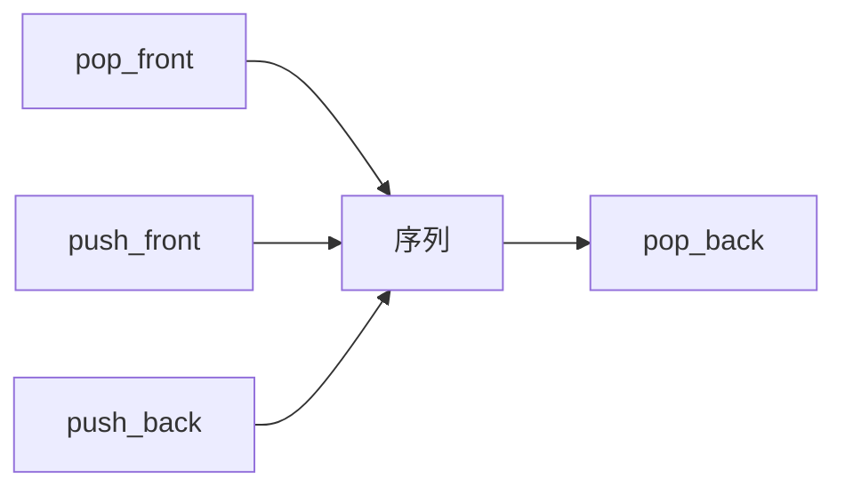

# 双端队列

两端都能进、两端都能出；栈和队列是它在操作集上的两个真子集。

<footer>—— 据 Knuth, The Art of Computer Programming 卷 1；Cormen, Leiserson, Rivest and Stein 整理</footer>

[上一课](/cs/queue-buffer)钉了 FIFO：尾进头出，并声明双端「主干不提前」。栈是一端 LIFO。本课不重讲环形模运算。缺口是 deque 合同：`push_front`/`push_back`/`pop_front`/`pop_back` 均摊还或最坏 $\Theta(1)$，用来做滑动窗口、两端生长的工作列。表示可以是双向链表，也可以是后课环形数组的两端指针。

## 问题

只提供队列则无法在队头插入；只提供栈则无法在底端取。算法里「最新的从一端进、过期的从另一端丢」（单调队列）需要两侧。缺口不是新的节点类型，而是**把序列的两端都暴露成 $O(1)$ 端点操作**，中间按下标仍可昂贵。

空时四端操作无定义或失败；实现不得把「头超过尾」留成未定义环。

STL deque 常用分块数组，使两端增长不必整表复制。本课先钉合同；块列是表示优化。

## 方法

链表表示：双向表的哨兵两侧即两端，四个操作都是改常数条边。数组表示：头尾两个下标，向左增长时 `head = (head-1+cap) mod cap`——这已是环形缓冲的雏形，下一课专收。

栈 = 只开同一端的 push/pop。队列 = 只开 `push_back` + `pop_front`。合同包含关系让测试用例可以共享。

## 机制

与[局部性原理](/cs/locality-principle)：链表 deque 两端操作仍是指针追逐；要扫中间更差。高频滑动窗口若元素连续，数组环形更好。本课允许两种，后课把环形从队列里提出来当独立表示。

中间插入删除若也要 $\Theta(1)$，调用方必须持有节点句柄，那是链表合同，不是下标 deque。混用会把随机访问假装成 $O(1)$。

## 边界

本课不引入优先双端（两端按键），那是堆的变体。也不写无锁 deque。扩容数组在两端同时增长时复制规则更烦，摊还课用单端表扩张即可，不必先在这里证明。

后课默认：需要两侧端点用 deque。定长高性能缓冲把数组收成环，头尾追逐，下一课只谈那一种布局。

## 小结

- deque 四端 $\Theta(1)$；栈与队列是操作子集。
- 链表或环形数组都能表示；局部性偏向数组。
- 环形布局与满空区分是下一课。
- 出处：Knuth, *TAOCP* 卷 1；Cormen et al. 对双端队列的接口。
