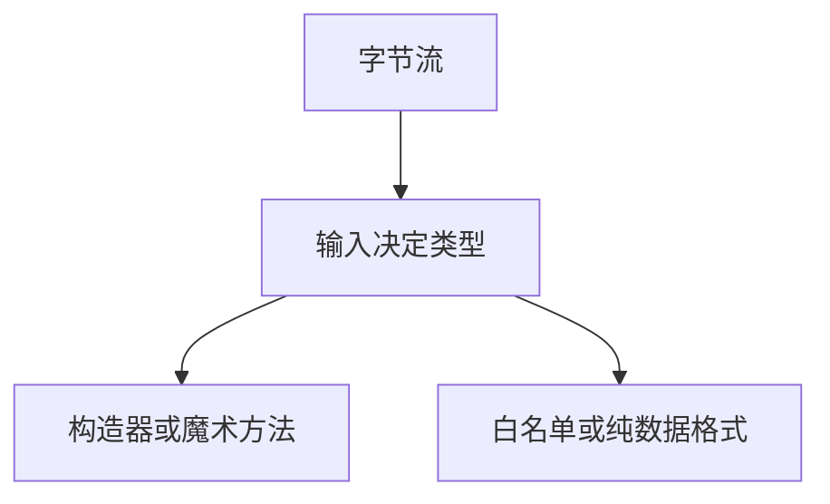

# 反序列化

把字节流变成对象图时，若类型与回调由输入决定，就会在还没到业务逻辑之前执行构造器与魔术方法。防御是只解白名单类型，或改用不执行代码的数据格式。

<footer>—— 据 CWE-502；OWASP 反序列化；对照 Java ObjectInputStream 与 pickle 的公开警告</footer>

## 定位

上一课[SSRF](/cs/ssrf)是网络代理人。缺口是**进程内把数据当代码合同**。本课讲不安全反序列化，不给 gadget 链。

后课默认已经读完本课钉下的合同，只补差，不从该领域第一性原理重开。

## 问题

Java 序列化、Python pickle、PHP unserialize：类型名在流里。可用链调用到危险汇。缺口是：JSON 到结构体通常更安全；必须反序列化则钉类型。

### 签名不自动够

签过的恶意流仍是恶意。完整性只保证没被改，不保证内容安全。

CWE-502。禁止 gadget 教程。与格式化字符串同构：解释器。

## 方法

对照 JSON/protobuf 与可执行序列化。审查：是否暴露反序列化端点。下一课路径穿越与上传。

图中节点是本课的机制骨架；课程不把图展开成可运行的攻击步骤。

## 机制

完整性：控制流在业务校验前被对象图劫持。路径穿越下一课是文件系统上的名字注入。

前提写进合同之后，游戏外的误用只当失败模式点名，不在本课写成操作程序。

## 边界

零链。路径穿越与上传下一课。

## 小结

- SSRF 借网络；反序列化借对象运行时。
- 类型必须由应用钉死。
- 换纯数据格式优于补 gadget。
- 下一课路径穿越。
- 出处：CWE-502；OWASP；pickle 与 Java 文档的警告。
