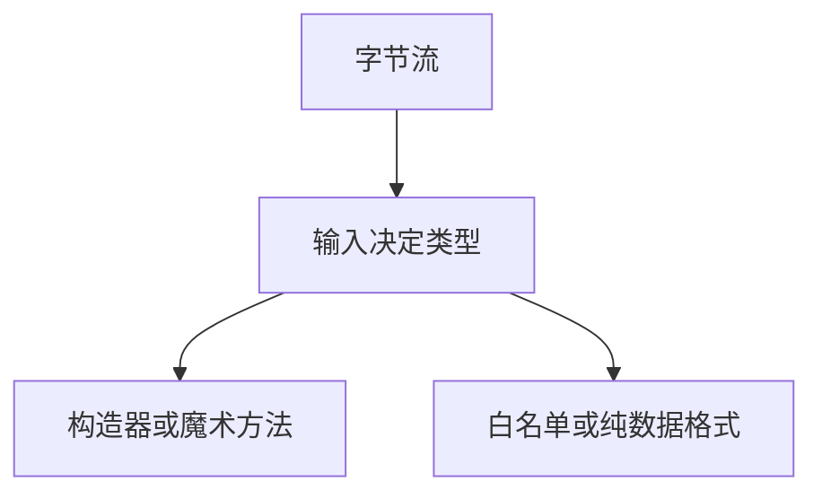
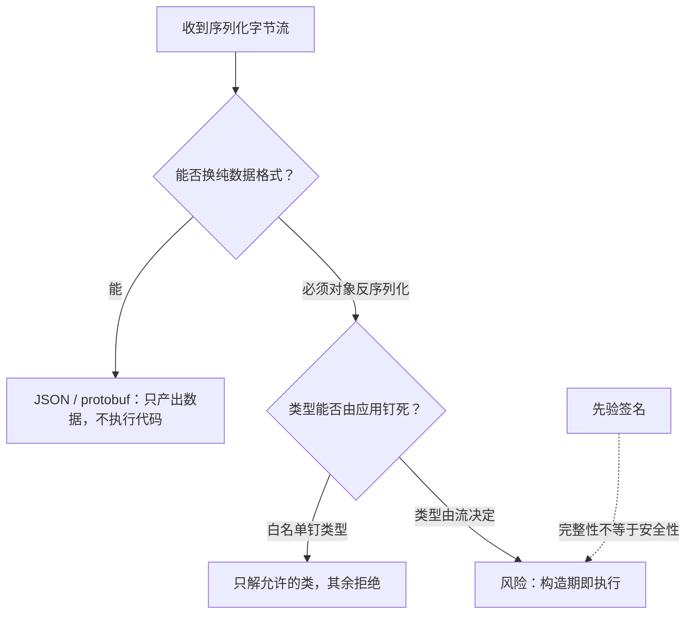

# 反序列化

把字节流变成对象图时，若类型与回调由输入决定，就会在还没到业务逻辑之前执行构造器与魔术方法。防御是只解白名单类型，或改用不执行代码的数据格式。

<footer>—— 据 CWE-502；OWASP 反序列化；对照 Java ObjectInputStream 与 pickle 的公开警告</footer>

上一课[SSRF](/cs/ssrf)是网络代理人。缺口是**进程内把数据当代码合同**。本课讲不安全反序列化，不给 gadget 链。

后课默认已经读完本课钉下的合同，只补差，不从该领域第一性原理重开。

## 问题

Java 序列化、Python pickle、PHP unserialize：类型名在流里。可用链调用到危险汇。缺口是：JSON 到结构体通常更安全；必须反序列化则钉类型。

术语翻译：反序列化就是「把字节流按约定组装回内存对象」。危险版本的差别在于：流里自带「这是哪个类」的答案，组装时会顺带执行该类的构造器与魔术方法——代码在运行到你写的第一行业务逻辑之前就已经跑起来了。

### 签名不自动够

签过的恶意流仍是恶意。完整性只保证没被改，不保证内容安全。

CWE-502。禁止 gadget 教程。与格式化字符串同构：解释器。

## 方法

对照 JSON/protobuf 与可执行序列化。审查：是否暴露反序列化端点。下一课路径穿越与上传。

```mermaid
flowchart TD
  BYTES["字节流"] --> TYP["输入决定类型"]
  TYP --> MAGIC["构造器或魔术方法"]
  TYP --> SAFE["白名单或纯数据格式"]
```

## 机制

完整性：控制流在业务校验前被对象图劫持。路径穿越下一课是文件系统上的名字注入。

拿到一份序列化字节流，处理路径应当先问两个问题再动手：

```mermaid
flowchart TD
  IN["收到序列化字节流"] --> Q1{"能否换纯数据格式？"}
  Q1 -->|"能"| JSON["JSON / protobuf：只产出数据，不执行代码"]
  Q1 -->|"必须对象反序列化"| Q2{"类型能否由应用钉死？"}
  Q2 -->|"白名单钉类型"| WL["只解允许的类，其余拒绝"]
  Q2 -->|"类型由流决定"| BAD["风险：构造期即执行"]
  SIG["先验签名"] -.完整性不等于安全性.-> BAD
```

常见误区：初学者以为「先验签名的流就安全」。签名只证明字节流没被中途篡改、出自持密钥者；若源头本身夹带恶意 gadget 链，或密钥已经泄露，带签名的恶意流照样在反序列化那一刻执行代码。完整性管的是「没被改」，不管「本来就好」。

直觉类比：不安全的反序列化像按来件自带的说明书组装包裹——说明书还写着「装好后请拨打这个号码」（回调）。包裹（字节流）一旦出自陌生人，说明书就可能让你亲手把危险装置接上电；纯数据格式则像只收零件、不收说明书的组装厂，装法由厂规（schema）说了算。

## 边界

零链。路径穿越与上传下一课。

## 小结

- SSRF 借网络；反序列化借对象运行时。
- 类型必须由应用钉死。
- 换纯数据格式优于补 gadget。
- 下一课路径穿越。
- 出处：CWE-502；OWASP；pickle 与 Java 文档的警告。
