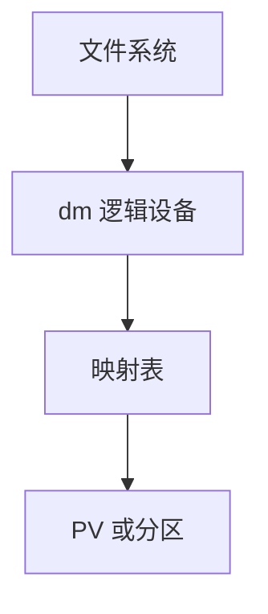

# device mapper 与 LVM

device mapper 把「逻辑块号」翻译成一个或多个底层设备上的段；LVM 用 PV/VG/LV 把这套映射做成可管理的卷。

<footer>—— 据 Linux device-mapper 文档；LVM2 设计说明；McKusick 对卷管理的背景</footer>

[上一课](/cs/scsi-stack)交出 `/dev/sd*`。[文件系统](/cs/ext2-block-groups) 以为自己拥有整盘。生产上要在线扩容、快照、加密——不必新做一种 FS。缺口是 **dm**：内核映射表；LVM 是用户态的表生成器。

## 问题

一张表：逻辑区间 → (磁盘, 偏移, 类型)。linear 拼接；striped 条带；snapshot 写时复制块设备（与 [btrfs 快照](/cs/fs-snapshots) 不同层）；thin 后课再讲。ioctl/`dmsetup` 装表，出现 `/dev/dm-N`。LVM：物理卷打标签，卷组凑空间，逻辑卷 = 一段表。缺口：挂载的是 LV 节点；扩容是改表加 FS `resize`；与 [设备节点](/cs/device-nodes) 的关系。

表可热替换（reload），有短暂冻结 I/O。镜像与 RAID 可走 dm 或后课 md。本课不把每一个 target 写成清单。

## 方法

读 LV 偏移 x：查表得底层 y，把 bio remap 下去。写 snapshot：第一次写某块时拷旧到 COW 区再写。对照 FS COW：这里粒度是设备块，文件系统不知情。对照 [NVMe](/cs/nvme-driver)：dm 仍在块层之上，每 I/O 多一次映射。

## 机制

dm 把存储虚拟化放进内核块层，使策略（扩容、加密、多路径）可组合：表可以叠（LV 上再 crypt）。LVM 只是把表存进元数据并在启动时恢复。不要把 LVM 快照当成 btrfs send 的替代叙述——粒度与一致性范围不同：设备快照不知道 FS 事务。

与 [fsync](/cs/fsync)：flush 要传到底层；表不能吞掉屏障，后课 FUA 再钉。

实现上：表 reload 时内核冻结目标，正在飞的 bio 要排完或重映射。LVM 元数据存在 PV 开头，损坏则 VG 消失，和 FS 超级块是两套备份故事。 读法上只引用[上一课](/cs/scsi-stack)的结论，不把对象换成训练推理或限价簿。

本课在操作系统进阶的「存储栈 / 块层到设备」课序里，对象是 **device mapper 与 LVM**。

- 先修只引用，不重导：上一课的结论当公理，本课只补差。
- 五栏不吞并：不把本课写成大模型训练/推理，也不写成限价簿或权重量化。
- 文献用 OSTEP、McKusick、内核文档与具名会议论文；不发明 arXiv 编号。

## 边界

本课不引入集群 LVM、lvmlockd。不保证精简池的丢弃行为——[精简配置](/cs/thin-provisioning) 专课。下一课另一条做 RAID 的内核路径：md。

版本字段会变，课序钉的是机制对象「device mapper 与 LVM」，不是某一主线内核的结构体名。
后课默认：逻辑卷是块层映射表。软 RAID 如何把多盘收成一个 md 设备，下一课。

## 小结

- dm 用映射表 remap bio；LVM 管理 PV/VG/LV。
- 设备级快照不是文件系统快照。
- md RAID 是下一课。
- 出处：Linux DM；LVM2；*OSTEP* 对 RAID/卷的背景。
