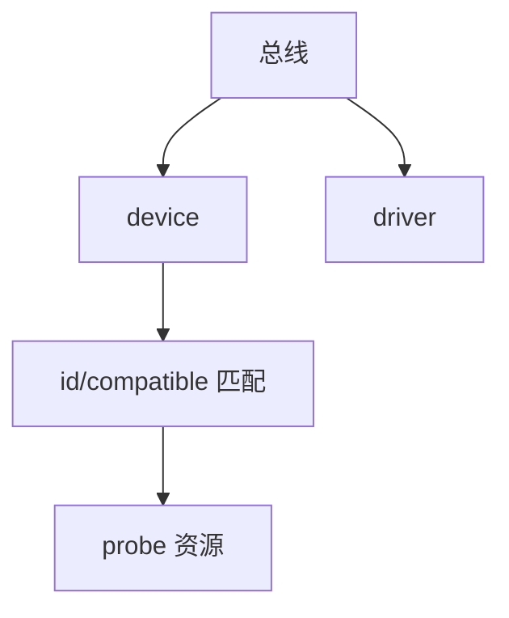

# 设备模型与驱动绑定

Linux 设备模型用 bus/device/driver 三元组：匹配成功则 probe，sysfs 导出属性，解绑则 remove。

<footer>—— 据 Corbet, Rubini, Kroah-Hartman, <em>Linux Device Drivers</em>；内核 driver-model 文档</footer>

[DT/ACPI](/cs/devicetree-acpi) 造出 `device`。缺口是 **绑定**：匹配表、probe、与 [设备节点](/cs/device-nodes) 的 cdev 注册。

## 问题

PCI：vendor/device id。平台设备：DT compatible。匹配后 `probe` 申请 IRQ、ioremap、注册子系统（块、net）。缺口：延迟探测、绑定失败回滚；sysfs `unbind`。本课不把每个总线类型写成清单。

uevent 通知 udev 后课。对象是内核对象图，不是硬件原理图。

## 方法

注册 driver → 对新 device 匹配 → probe。对照 [FUSE](/cs/fuse)：用户实现操作；这里是内核 C。对照 [NAPI](/cs/napi)：probe 里注册 napi。对照 LSM：probe 仍要能力。

## 机制

设备模型让热插、电源、sysfs 有统一骨架，驱动只填总线相关。它是「一切皆文件」在设备侧的内核实现。不要写成 Windows INF 课。与 [IOMMU](/cs/dma-coherence)：probe 时设 DMA 掩码。

循环依赖（设备等时钟、时钟等设备）靠框架延迟。

实现上：deferred probe 解决时钟与设备的循环依赖，但会让「驱动已加载却无节点」持续一段时间。sysfs unbind 可拆驱动，热升级用这个。模块卸载要 refcount 为零。 读法上只引用[上一课](/cs/devicetree-acpi)的结论，不把对象换成训练推理或限价簿。

本课在操作系统进阶的「安全、启动与调试 / 内核安全与启动」课序里，对象是 **设备模型与驱动绑定**。

- 先修只引用，不重导：上一课的结论当公理，本课只补差。
- 五栏不吞并：不把本课写成大模型训练/推理，也不写成限价簿或权重量化。
- 文献用 OSTEP、McKusick、内核文档与具名会议论文；不发明 arXiv 编号。

## 边界

本课不引入 component helper 的全部。不保证用户态驱动（VFIO）走同一 probe。下一课字符设备与 ioctl。

版本字段会变，课序钉的是机制对象「设备模型与驱动绑定」，不是某一主线内核的结构体名。
后课默认：匹配则 probe 并导出 sysfs。cdev 与 ioctl ABI，下一课。

## 小结

- bus 匹配 device 与 driver，probe 申请资源。
- sysfs 是该模型的用户可见面。
- 字符设备 ioctl 是下一课。
- 出处：LDD3；Linux driver-model。
