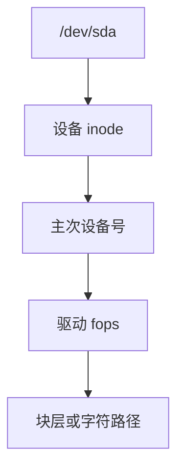

# 设备节点

设备节点是带主次设备号的 inode：打开它不读数据块，而是把后续 I/O 送到对应驱动。

<footer>—— 据 Thompson, UNIX Implementation；Bach；Linux devices.txt 对主次号的整理</footer>

[上一课](/cs/tmpfs)的文件仍是页。Unix「一切皆文件」还包括磁盘、终端、随机数：[inode](/cs/inode-dir) 类型为字符或块设备，内容是 **dev_t**。缺口是设备节点与 [VFS](/cs/vfs) 如何接到驱动，而不是存储栈的调度器。

## 问题

若用户必须 `ioctl` 一个隐藏句柄才能访问磁盘，POSIX 工具链裂开。设备节点：`mknod` 在某文件系统（常为 devtmpfs）上造 inode，`open` 走 `chrdev_open`/`blkdev_open`，fops 来自驱动。块设备还可再被挂载成 FS——同一盘既有 `/dev/sda` 又有 `/`。缺口：主次号分配、`uevent` 与后课 udev、以及权限（谁能打开裸盘）。

字符设备按字节流；块设备按块，可走页缓存（缓冲 I/O）。裸盘 `O_DIRECT` 是后课。本课不把 NVMe 多队列写完。

## 方法

`read(/dev/zero)`：驱动填零，不经块分配器。`read(/dev/sda)`：块层按偏移读扇区，可进页缓存（bdev inode）。`ioctl` 传送设备特定命令。对照普通文件：没有 extent，偏移是设备地址。对照 [FUSE](/cs/fuse)：用户态也可以实现字符设备，但经典路径是内核 cdev。

## 机制

设备节点把驱动登记进文件系统名空间，使权限、打开计数、poll 与普通文件共用 VFS。这是 Unix 的关键接头：备份、dd、加密卷都从打开一个节点开始。不要把本课写成硬件总线枚举全文——[设备模型](/cs/device-model-binding) 在启动课序。

与 [rename](/cs/rename-atomicity)：设备节点可改名，主次号不变；删除节点不卸载驱动。

实现上：devtmpfs 在内核里造节点，udev 再改名。容器里 mknod 常被 cap 与设备 cgroup 拦住，不是 VFS 不懂设备。块设备的 bdev inode 有自己的页缓存，和文件系统页缓存是两套。 读法上只引用[上一课](/cs/tmpfs)的结论，不把对象换成训练推理或限价簿。

本课在操作系统进阶的「文件系统实现 / 接口进阶」课序里，对象是 **设备节点**。

- 先修只引用，不重导：上一课的结论当公理，本课只补差。
- 五栏不吞并：不把本课写成大模型训练/推理，也不写成限价簿或权重量化。
- 文献用 OSTEP、McKusick、内核文档与具名会议论文；不发明 arXiv 编号。

## 边界

本课不引入 namespace 里的设备可见性全部规则。不保证容器里 mknod 被 cap 拦住的每条路径——capabilities 后课。下一课从「打开了文件/设备」走到读路径优化：预读。

版本字段会变，课序钉的是机制对象「设备节点」，不是某一主线内核的结构体名。
后课默认：设备是带主次号的 inode。顺序读如何提前拉块进页缓存，下一课预读。

## 小结

- 设备节点把主次号接到驱动 fops。
- 块设备可再被挂载；字符设备是字节接口。
- 预读是下一课。
- 出处：Thompson；Bach；Linux device 文档；Tanenbaum *MOS*。
