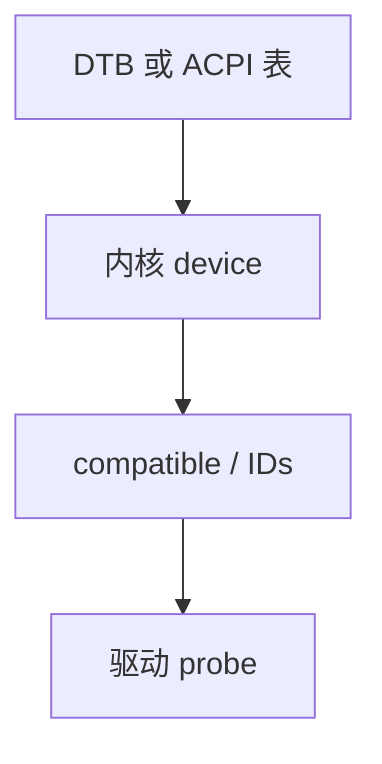

# 设备树与 ACPI

设备树用 DTB 描述非发现总线的硬件；ACPI 用表与 AML 在 PC 上描述资源、热插与电源。内核靠它们实例化设备。

<footer>—— 据 Devicetree 规范；ACPI 规范概述；Linux 对 OF/ACPI 的文档</footer>

[cmdline](/cs/kernel-cmdline) 不能列出每条 I2C 设备。[PCI](/cs/dma-coherence) 可探测。缺口是 **固件描述**：DT vs ACPI，以及两者如何接到驱动。

## 问题

ARM 板无 BIOS 枚举：DT 节点 + compatible 字符串匹配驱动。x86：ACPI 表、_CRS 资源。缺口：overlay DT、ACPI 与 DT 并存（arm64 服务器）；错描述导致驱动不绑。本课不把 AML 写成编译课。

设备树是数据，不是驱动程序。电源域、时钟也在图里。对象是枚举，不是写驱动逻辑。

## 方法

启动：解 DTB 或找 RSDP。创建 `struct device`。对照 [SCSI 扫描](/cs/scsi-stack)：可发现 vs 描述。对照 [net_device](/cs/skbuff)：网卡 PCI 可发现，板上 PHY 可能在 DT。对照 systemd：用户态 udev 后课用 uevent。

## 机制

DT/ACPI 把「这块板有什么」从内核源码里拆出，使同一镜像可在多板上启动。错误固件是嵌入式第一杀手。不要写成电路图课。与 [热插拔内存](/cs/memory-hotplug)：ACPI 通知是来源。

安全：恶意 ACPI 可在高特权跑 AML——锁定与签名是平台问题。

实现上：compatible 是字符串列表，驱动匹配最具体的。ACPI AML 可在启动时解释，错误表能让核在早期挂。arm64 服务器常 ACPI+DT 并存，资源以谁为准要查。 读法上只引用[上一课](/cs/kernel-cmdline)的结论，不把对象换成训练推理或限价簿。

本课在操作系统进阶的「安全、启动与调试 / 内核安全与启动」课序里，对象是 **设备树与 ACPI**。

- 先修只引用，不重导：上一课的结论当公理，本课只补差。
- 五栏不吞并：不把本课写成大模型训练/推理，也不写成限价簿或权重量化。
- 文献用 OSTEP、McKusick、内核文档与具名会议论文；不发明 arXiv 编号。

## 边界

本课不引入 OpenFirmware 历史全文。不保证 RISC-V 只有 DT。下一课内核如何把驱动绑到 device：设备模型。

版本字段会变，课序钉的是机制对象「设备树与 ACPI」，不是某一主线内核的结构体名。
后课默认：硬件由 DT 或 ACPI 描述并实例化。驱动绑定与总线，下一课。

## 小结

- DT 描述不可发现的硬件；ACPI 服务 PC 电源与资源。
- compatible/ID 用来匹配驱动。
- 设备模型绑定是下一课。
- 出处：Devicetree spec；ACPI；Linux driver model。
