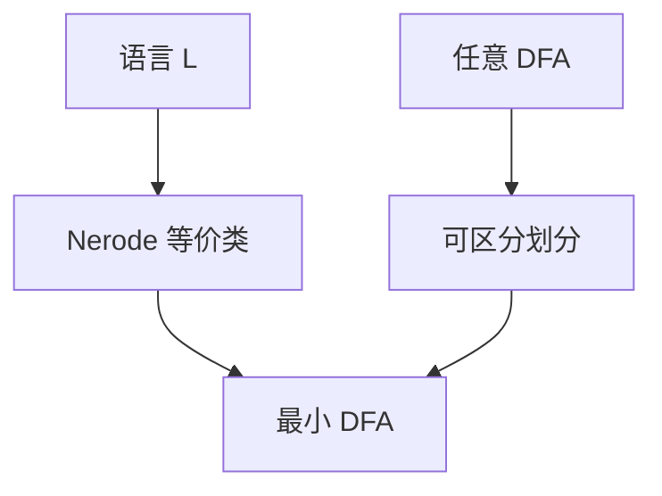

# DFA 最小化与 Myhill–Nerode

正则语言对应字母表上的有限指数右同余；等价类就是最小 DFA 的状态，个数是语言的固有不变量。

<footer>—— 据 Nerode, Linear Automaton Transformations, 1958；Hopcroft, 1971 整理</footer>

上一课[泵引理](/cs/pumping-lemma-regular)给出排除正则的必要性质，并点名「有些非正则可泵」。本课不重写博弈。缺口是**充要刻画**：Myhill–Nerode 等价类有限当且仅当语言正则，并且最小 DFA 在同构意义下唯一。主干[NFA/DFA](/cs/nfa-dfa)只说过「确定化之后可再压状态」。

## 问题

同一正则语言可以有许多 DFA，状态数从子集构造的 $2^{|Q|}$ 到「刚好够用」。何谓够用？对 $x,y\in\Sigma^*$，定义 $x\sim_L y$ 当且仅当 $\forall z,\ xz\in L\iff yz\in L$。这是右同余。指数（等价类个数）有限 $\iff$ $L$ 正则。每个类做成一个状态，$\delta([x],a)=[xa]$，接受类是那些 $x\in L$。

泵引理看不到「两个前缀是否永远可互换」。$\{a^nb^n\}$ 的前缀 $a^i$ 两两不等价（后面跟 $b^i$ 才能分），指数无穷，故非正则——这补上泵失败时的工具。

### 最小不是「看起来少」

任意 DFA 可按可区分性合并：两状态 $p,q$ 可区分，若存在 $z$ 使恰好一个走到接受。Hopcroft 划分细化给出 $O(|Q||\Sigma|\log|Q|)$ 算法。最小化结果与 Nerode 自动机同构。少一个状态就会认错语言。

Nerode 1958；Myhill 的同余更偏句法。Hopcroft 1971 最小化是词法生成器的标准步骤。本课要的是不变量 $|Q_{\min}|$，不手写全部划分表。

## 方法

对给定 $L$，尝试列出无穷多两两可区分的前缀，即证非正则。对给定 DFA，算不可区分划分，商自动机即最小。不要把 NFA 最小化当多项式问题——NFA 最小状态数是难的，本课对象是 DFA。

[Thompson](/cs/thompson-nfa) 与子集构造之后接本课，才得到词法器里那张紧表。本补层不重做构造，只收等价类。

## 机制

$|Q_{\min}|$ 是语言的复杂度，与具体正则式写法无关。指数无穷就是「需要无限记忆的前缀」。后课封闭性证明常构造乘积自动机，再最小化只是工程；正确性不依赖最小。

不要用状态数比较 NFA 与 DFA 的「谁更强」：语言类相同，状态可以指数分开。

Hopcroft 划分从「接受/拒绝」两块出发，用字母表符号细化，直到稳定。实现是词法生成器的标准后段，本课要的是：最小状态数是 $L$ 的不变量，与你怎么写正则式无关。NFA 状态数可以远小于 DFA，但不能拿来当 Myhill–Nerode 指数。

## 边界

本课不证 Hopcroft 算法的对数因子，不讨论 NFA 最小化的 PSPACE 性。不把 Myhill–Nerode 推广到树自动机。后课默认：正则 $\iff$ 有限指数右同余；谈「唯一最小 DFA」即这个对象。封闭性是下一课在运算下保持这一类。

## 小结

- $\sim_L$ 有限指数当且仅当 $L$ 正则；类即最小状态。
- DFA 按可区分性商掉，结果唯一。
- 无穷多可区分前缀 $\Rightarrow$ 非正则，补泵引理。
- 出处：Nerode, 1958；Hopcroft, 1971。
