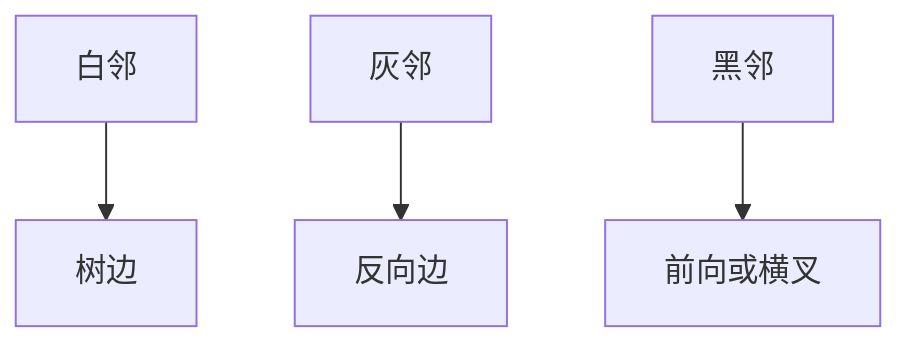

# DFS 与边分类

深度优先的进出时刻把每条边标成树边、反向边、前向边或横叉边；环与否写在反向边上。

<footer>—— 据 Tarjan, Depth-First Search and Linear Graph Algorithms, 1972；CLRS 第 22 章整理</footer>

上一课[BFS 与无权最短路](/cs/bfs-unweighted)用队列得到无权距离。本课不重做分层。缺口是：图上还有**结构**——有没有环、哪些边连回祖先、哪些边连到另一棵树上的点。栈式深入加上发现/完成时刻，才能给边分类。本课只钉 DFS 与四类边（无向图上收缩成树边与反向边）。

## 问题

BFS 树几乎不谈回边：同一层或邻层的非树边不回答「是否有向环」。缺口是时间戳：$u.d$ 发现、$u.f$ 完成，括号性质：两个区间要么嵌套要么不相交。树边进入白邻；反向边指向祖先（有向环的证据）；前向边指向已完成的真后代；横叉边指向既非祖先也非后代的已发现点。

[DAG 预备](/cs/dag-repr)说过无环可排序；本课给出检测：有向图有环当且仅当 DFS 发现反向边。拓扑序本身下一课才写。

### 递归栈就是那条路

DFS 的灰色顶点链是当前从根到 $u$ 的路径。指向灰色即反向。指向黑色则按时间戳分成前向与横叉。不要用「看起来像回头」的口语代替颜色与时刻。

Tarjan 用 DFS 做强连通与双连通；本课只取边分类与括号定理，强连通不展开。CLRS 22.3 的分类是后课拓扑、桥与割点的共同前置。

## 方法

对每个白点开一次 `DFS-VISIT`：置发现时刻，扫邻接表，递归白邻（树边），最后置完成时刻。全图 $\Theta(V+E)$。无向图：每条边只分类一次，非树边都是反向边（连祖先）。

括号：$u$ 是 $v$ 祖先当且仅当 $[v.d,v.f]\subset[u.d,u.f]$。后课拓扑按完成时刻降序，依据就在这里。

## 机制

边分类依赖**第一次** DFS 森林。另一次不同的顶点序可以换树边集合，但「有无反向边」对有向环不变。无向图的横叉在标准分类里不出现，因为先发现的端点会把边当树边或反向边用掉。

不要把 BFS 的非树边叫反向边：那不是 DFS 时刻。两种遍历的树都是生成林，职责不同。

## 边界

本课不算最短路。不写强连通分量的第二次 DFS。不引入桥与割点的 low 值。有向图的横叉边不单独构成环。后课拓扑排序假定会看完成时刻或入度，不再从颜色讲起。

后课默认：DFS 给出 $d/f$ 与边分类；有向环 $\Leftrightarrow$ 反向边。拓扑是下一课把 DAG 变成线性序。

## 小结

- DFS 用发现/完成时刻给边分类；括号嵌套即祖先。
- 有向环当且仅当存在反向边。
- 代价仍 $\Theta(V+E)$；不给出距离。
- 出处：Tarjan, 1972；CLRS 第 22.3 节。
