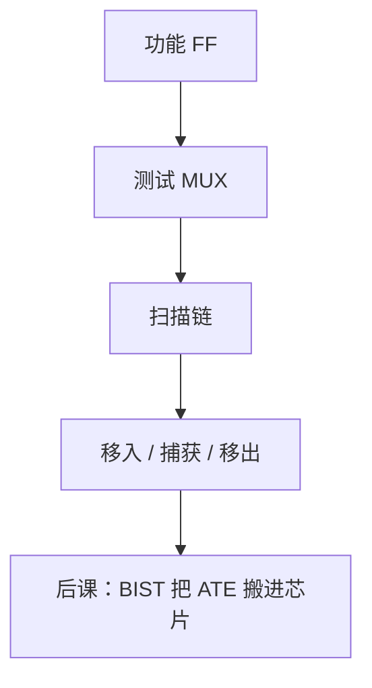

# 可测性设计与扫描链

  
封装之后没有探针扎到每个触发器；把 FF 串成移位寄存器，测试仪才能移入向量、移出响应，判断组合逻辑是否粘死。

  <footer>—— 据 Bushnell and Agrawal, Essentials of Electronic Testing；IEEE Std 1149.1（JTAG）；Weste and Harris, CMOS VLSI Design 整理</footer>

[上一课](/cs/formal-equivalence)保证网表与 RTL 一致，不保证**硅**无缺陷。[摩尔经济学](/cs/moore-law-economics)把测试成本算进单价。缺口是 **DFT**：扫描链把触发器变成可控可观，否则自动测试仪（ATE）够不着内部节点。

## 问题

固定故障（stuck-at）模型：某网恒 0/1。要激活故障并传播到可观察点。全组合电路还可用输入直接控；时序电路状态空间太大。扫描：每只 FF 加 MUX，测试模式时 D 来自上一只 FF 的 Q，链成移位寄存器。缺口不是再做 LEC，而是这套测试结构如何插入、如何与功能时钟共存。

IEEE 1149.1 JTAG 提供芯片级 TAP，边界扫描测引脚与板级互连；内部扫描是同一思想往里走。

### 扫描不是「功能复位」

扫描移位时状态无功能含义，翻转率高、功耗大，须遵守测试功耗预算。功能复位树在测试模式可能被旁路。把扫描使能当复位，量产测试会破坏芯片或给出假失败。

Bushnell/Agrawal 是测试教材。1149.1 是边界扫描标准。Weste/Harris 有扫描 FF 电路。本课不背全部故障模型（转换延迟故障点名即可）。

## 方法

综合后插入扫描 FF 与链。ATE：scan-in 一向量，脉冲一次功能捕获，scan-out。ATPG 生成向量。约束：扫描链时钟、锁存器电平敏感扫描（LSSD）是另一风格。与 [STA](/cs/sta)：扫描移位路径有自己的时序，常更慢，单独约束。

算术单元的宽乘法器组合锥正是 ATPG 的负担；测试点插入可提高覆盖。

## 机制

下一课 BIST 用片上图案生成器减少 ATE 数据量。扫描改变网表，必须再 LEC（功能模式 scan-enable=0）。时钟门控在测试中强制开。复位与扫描冲突由 DFT 规范定义。

## 边界

本课不写模拟 BIST、不把系统级软件测试当 DFT。不讨论故障定位的软件算法细节。不进入封装探针卡机械。

后课默认：量产数字测试依赖扫描链把 FF 串起来；JTAG 管边界；内部还有 BIST。

## 小结

- 封装后靠扫描移位控/观内部 FF。
- 插入 MUX 改网表，功能模式须再等价检查。
- 测试功耗与扫描时序单独约束。
- 出处：Bushnell and Agrawal；IEEE 1149.1；Weste and Harris。
