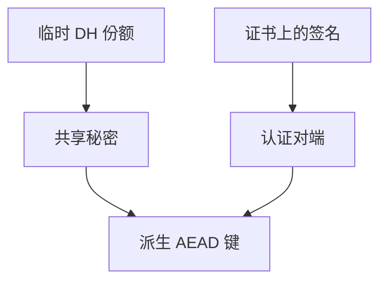

# DH 与 RSA 分工

DH 让双方在公开信道上得到共享秘密；RSA 加密能封住一段会话键。当代握手多把认证与封装拆开，而不是一种算法包办。

<footer>—— Diffie and Hellman, 1976；Rivest, Shamir and Adleman, 1978；RFC 8446 的分工对照</footer>

[上一课](/cs/pubkey-envelope)给出信封：公钥运对称键。本课不重画「大数据走对称」。缺口是两种常见公钥活：Diffie–Hellman 密钥协商与 RSA 加密封装（历史上还有 RSA 签名）。哈希与碰撞下一课才进完整性原语。中间人若无认证，DH 会对错误对端成功——后课证书收口。

## 问题

信封课把公钥当「能封」。实践有两条路。DH（及椭圆曲线变体）：双方临时公钥，导出共享秘密，再派生 AEAD 键；认证另用签名。RSA 加密：用对端长期公钥封随机会话键。RFC 8446 去掉 RSA 密钥传输，保留（EC）DHE + 签名。缺口是**协商对封装的分工**，不是数论证明。

前向保密：临时 DH 使长期签名钥泄露不解密过去会话。静态 RSA 封装通常没有这层。这是机制，不是配置命令。

## 方法

TLS 1.3：Hello 带密钥份额，共享秘密进 HKDF，证书链验证签名。应用若自造协议，不要把「RSA 加密一段口令」当会话。本课不给参数选择菜谱，只要求认清哪一步做认证、哪一步做密钥。

## 机制

分工避免一把长期加密钥既认证又解密历史。DY 模型里未认证的 DH 只得到「与某匿名对端的共享秘密」。后课 PKI 把名字绑到验证密钥。哈希课提供签名要吃的摘要。

## 边界

本课不引入后量子封装算法当主干必选。摘要为何要抗碰撞，下一课哈希。

后课默认：会话键来自 DH 类协商加认证。完整性原语从哈希开始。

## 小结

- DH 协商共享秘密；RSA 曾用于封装，TLS 1.3 不再做密钥传输。
- 认证与封装分开才有前向保密。
- 哈希与碰撞下一课。
- 出处：Diffie–Hellman 1976；RSA 1978；RFC 8446。
