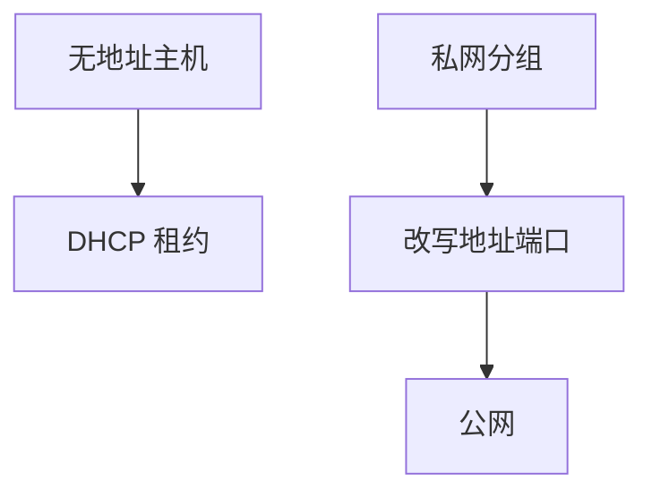

# DHCP 与 NAT

DHCP 把地址与默认路由租给主机；NAT 让私网多台主机复用少量公网地址，改写 IP 与端口。

<footer>—— 据 RFC 2131, Dynamic Host Configuration Protocol；RFC 3022, Traditional IP Network Address Translator 整理</footer>

[上一课](/cs/icmp)假定主机已有地址。[IP 编址](/cs/icmp)要每接口一个 IP；手工配置不能规模化，IPv4 公网地址也不够每人一台。缺口是两件配套：**DHCP 租约**与 **NAT 复用**。本课不把 IPv6 地址空间当已解决。

## 问题

主机启动时还没有 IP，不能先打开一个「配置 TCP」。DHCP：发现、提供、请求、确认，在 UDP 广播/中继上完成，交出地址、掩码、网关、DNS（DNS 课再用）。NAT：边界路由器改写私网源地址为公网，用端口区分会话，回包再改回。缺口不是 LPM 公式，而是地址的**获得与改写**。

本课不把 CGNAT 的全部端口耗尽策略写完。

私网段 RFC 1918：`10/8`、`172.16/12`、`192.168/16`。NAT 破坏「每个地址全球可达」，与端到端论证紧张：新会话难从外向内建。

## 方法

DHCP 客户端在 UDP 68，服务器 67；租约到期续租。NAT 表：(协议, 私网 IP, 端口) ↔ (公网 IP, 端口)，对 TCP/UDP 有状态；ICMP 用查询 ID 等。TTL 与校验和随改写重算。ALG 曾修补 FTP 等嵌地址的协议，脆弱，主干不依赖。

## 机制

DHCP 填好[子网](/cs/ip-subnet)课的配置，主机才能 ARP 网关。NAT 让 [LPM](/cs/lpm) 在公网只看见少量前缀，却让传输层五元组在边界被改写——后课 TCP 必须容忍，或应用改用中继。端到端：NAT 是中间盒状态，不是 Saltzer 意义上的「端」。这是后课 QUIC 与 NAT 超时、以及 IPv6 推动的背景。

与[进程](/cs/process-image)无关：改写发生在路由器，主机套接字仍绑定私网地址。

## 边界

本课不把 DHCP 欺骗写成攻击教程。不引入 IPsec 穿越 NAT 的全部封装。IPv6 用 SLAAC/DHCPv6，对照下一课；不要把 NAT66 当 IPv6 的必经之路。

中继代理让服务器不在广播域内。NAT 对分片重组的依赖是实现地雷，主干假定不分片或先重组再改写。

租约续期失败则地址应停止使用；NAT 表项超时则内网会话静默断开。

后课默认：IPv4 常靠 DHCP 与 NAT 撑着。地址长度与邻居发现如何换一套，下一课 IPv6 对照。

## 小结

- DHCP（RFC 2131）租地址与网关；NAT（RFC 3022）复用公网地址。
- NAT 改写五元组，削弱端到端可达。
- IPv6 用更大地址空间对照，下一课。
- 出处：RFC 2131；RFC 3022；RFC 1918；Kurose and Ross。
