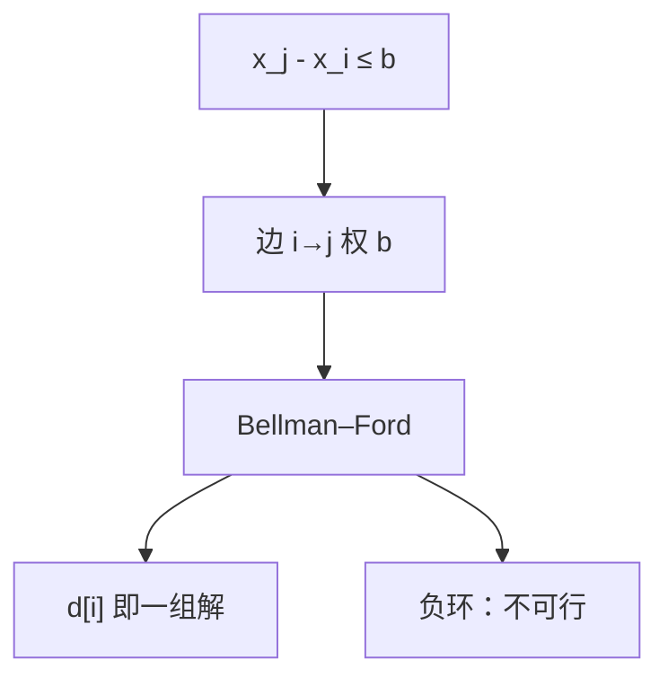

# 差分约束

一组 $x_j-x_i\le c_k$ 有解，当且仅当约束图画出来没有负环；一组解就是某源点的最短路距。

<footer>—— 据 Bellman, On a Routing Problem, 1958；CLRS 第 24.4 节整理</footer>

上一课[Bellman–Ford](/cs/bellman-ford)能在负边图上算单源最短路，并在第 $|V|$ 轮检测可达负环。点名过：不等式可化成边。本课不重写 $|V|-1$ 轮松弛。缺口是把**差分约束系统**写成那张图：变量当顶点，约束当边，可行当且仅当无负环。后课全源换成中间点 DP，不再解不等式。

## 问题

实数变量 $x_1,\ldots,x_n$，约束均形如 $x_j-x_i\le b_{ij}$。加一个超源 $s$ 向每个 $x_i$ 连权 $0$ 的边，再对每条约束加边 $i\to j$、权 $b_{ij}$（从 $i$ 走到 $j$ 的边权是 $x_j$ 的上界增量）。若该图无负环，令 $x_i=\delta(s,i)$，则三角不等式 $\delta(s,j)\le\delta(s,i)+b_{ij}$ 即 $x_j-x_i\le b_{ij}$。有负环则沿环把约束加起来得到 $0\le$ 负数，不可行。

缺口不是线性规划单纯形，而是「这组线性不等式 = 一张最短路图」。等式 $x_j-x_i=c$ 拆成两条反向约束。严格不等式在整数变量上改写成 $\le c-1$。

### 解不是唯一的

最短路给出一组特解。全体解是特解加同一常数（或按连通块平移），因为只约束差。要 $x_i\ge 0$ 再加边；要最大化某差，仍是最短/最长路，本课只钉可行性与一组可行解。

CLRS 24.4 把差分约束当作 Bellman–Ford 的应用。边权为 $b_{ij}$ 的方向必须与「$x_j$ 不超过 $x_i$ 加这么多」一致；画反则负环含义翻掉。

## 方法

建图 $G$：$n+1$ 个点。跑 Bellman–Ford。负环 → 报告无解。否则输出 $d[i]$。代价 $O((n+1)(n+m))$，与约束条数 $m$ 线性于边。

约束图不是残量网络，不要把流的反向边请进来。与[拓扑](/cs/topo-sort)：若所有 $b$ 使图为 DAG，一轮松弛即可，不必 $|V|-1$。

## 机制

最短路三角不等式与差分约束是同一件事的两边。调度里「任务 $j$ 不早于 $i$ 结束加 $p$」写成这种差；本课不展开车间调度。整数与有理约束在无负环时都有解；无理边权的数值误差与上一课相同。

不要对约束图跑 Dijkstra：边权 $b_{ij}$ 可负。

## 边界

本课不做全源、不写费用流。线性规划一般型（任意 $Ax\le b$）不能化成差，那不是本课。后课默认：形如 $x_j-x_i\le c$ 的系统用最短路；负环即矛盾。稠密全源下一课用 Floyd，对象换成点对距离，不再是变量差。

## 小结

- $x_j-x_i\le c$ ↔ 边 $i\to j$ 权 $c$；可行 ↔ 无负环。
- 超源最短路给出一组解。
- 可负权，故用 Bellman–Ford 而非 Dijkstra。
- 出处：Bellman, 1958；CLRS 第 24.4 节。
