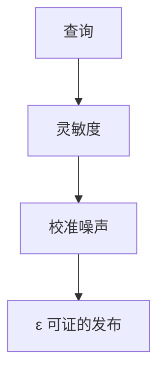

# 差分隐私

差分隐私给发布机制一张证明：任意一条记录在或不在，对输出分布的影响有界。隐私损失可加，预算要记账。它不靠「匿名化感觉」。

<footer>—— Dwork, McSherry, Nissim and Smith, Calibrating Noise to Sensitivity, TCC 2006；Dwork and Roth, *The Algorithmic Foundations of Differential Privacy*</footer>

## 定位

上一课[容器](/cs/container-escape)结束系统硬件。隐私单元从可证明的发布机制起。缺口是**查询输出仍可能认出个体**。本课钉 ε-差分隐私，不重写密码学。

后课默认已经读完本课钉下的合同，只补差，不从该领域第一性原理重开。

## 问题

聚合计数仍可差分攻击。DP：相邻数据集上输出不可区分到 e^ε。缺口是灵敏度、噪声、组合。

### 不是加密

DP 保护的是发布分布，数据在服务器仍可能明文计算——除非叠 MPC/同态。

DMNS 2006。k-匿名下一课是句法匿名，已被证明不够。

## 方法

拉普拉斯机制点名。会计：基本组合。下一课 k-匿名对照。

图中节点是本课的机制骨架；课程不把图展开成可运行的攻击步骤。

## 机制

把隐私当预算。k-匿名下一课无这种预算语言。

前提写进合同之后，游戏外的误用只当失败模式点名，不在本课写成操作程序。

## 边界

不把 ε 选成口号。k-匿名下一课。

## 小结

- 隔离课之后，发布数据要另套合同。
- DP：相邻集输出近，预算可加。
- 不是加密，也不是感觉匿名。
- 下一课 k-匿名。
- 出处：Dwork, McSherry, Nissim and Smith, 2006；Dwork and Roth。
