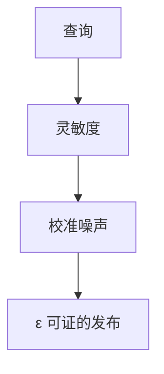
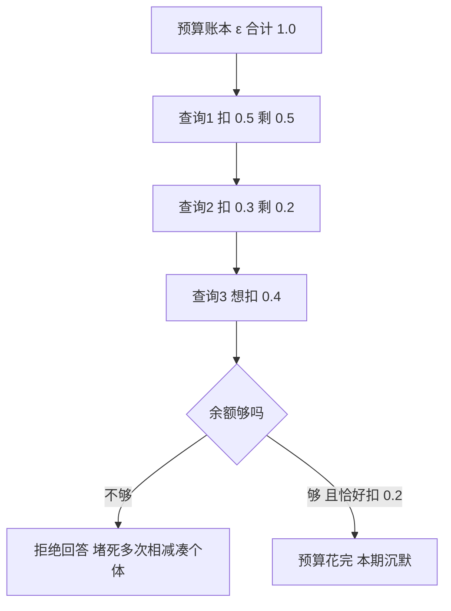

# 差分隐私

差分隐私给发布机制一张证明：任意一条记录在或不在，对输出分布的影响有界。隐私损失可加，预算要记账。它不靠「匿名化感觉」。

<footer>—— Dwork, McSherry, Nissim and Smith, Calibrating Noise to Sensitivity, TCC 2006；Dwork and Roth, *The Algorithmic Foundations of Differential Privacy*</footer>

上一课[容器逃逸](/cs/container-escape)结束系统硬件线；隐私单元从可证明的发布机制起步。缺口是**聚合查询的输出仍可能认出个体**——两次计数相减就是一个人的答案。本课钉 ε-差分隐私，不重写密码学。

后课默认已经读完本课钉下的合同，只补差，不从该领域第一性原理重开。

## 问题

聚合也挡不住差分攻击：知道某人已在总表，再查含她的子集计数，相减即知她的属性。DP 的合同：相邻数据集（只差一条记录）上，机制输出分布的似然比不超过 $e^\varepsilon$——任意一条记录在或不在，任何结论的概率都几乎不变。缺口是三件：灵敏度怎么算、噪声怎么按灵敏度校准、多次查询怎么记账。

数字实例：$\varepsilon=0.1$ 意味着无论张三在不在数据集里，你看到任何输出的概率比至多 $e^{0.1}\approx1.105$——只差一成左右；而 $\varepsilon=10$ 时 $e^{10}$ 上万倍，这条「几乎不变」基本不设防。所以 ε 取值大小就是隐私强弱本身。

常见误区：以为「匿名化 = 删掉姓名」就安全了。Netflix 大赛与纽约出租车数据都证明：把两份「匿名」表相减、或拿外部数据一对齐，个体照样现形。差分隐私防的正是这类「任意背景知识」的攻击，而不是赌对手手里的信息不够多。

### 不是加密

不是加密：DP 保护的是发布结果的分布，服务器内部照常明文计算；要连计算过程也不暴露，得另叠 MPC 或同态——正交的层。

直觉类比：灵敏度 $\Delta$ 就是「一个人的答案最多能把结果撬动多少」。数人头时 $\Delta=1$，一个人顶多让计数加一；查总收入时 $\Delta$ 等于最富那位的收入。噪声按 $\Delta$ 校准——先量出「一个人能掀多大浪」，再决定盖多厚的布。

DMNS 2006。k-匿名下一课是句法匿名，已被证明不够。

## 方法

方法是拉普拉斯机制：真值加按灵敏度 $\Delta$ 缩放的拉普拉斯噪声，$\varepsilon$ 越小噪声越大——DMNS 的贡献正是「按灵敏度校准」，噪声不多不少。会计用基本组合：$k$ 次查询合计预算 $\sum\varepsilon_i$，预算花完不再回答；「预算可加」是这个体系区别于一切句法方法的地方。下一课 k-匿名对照。

```mermaid
flowchart TD
  Q["查询"] --> SENS["灵敏度"]
  SENS --> NOISE["校准噪声"]
  NOISE --> OUT["ε 可证的发布"]
```

## 机制

机制的本质是把隐私变成可记账的量：每次发布从预算里扣 ε，组合定理保证总泄漏不超账面——「多问几次凑出个体」这条路被数学封死，且保证对任意攻击者与任意背景知识一致成立。代价在实用性：长尾小分组上的噪声过于显著，预算经不起高频消费。k-匿名下一课无这种预算语言。

上面那张图画「单次查询怎么加噪发布」；这张看预算账本：ε 怎么一次一次扣，扣完之后发生什么。

```mermaid
flowchart TD
  LEDGER["预算账本 ε 合计 1.0"] --> Q1["查询1 扣 0.5 剩 0.5"]
  Q1 --> Q2["查询2 扣 0.3 剩 0.2"]
  Q2 --> Q3["查询3 想扣 0.4"]
  Q3 --> DENY{"余额够吗"}
  DENY -- "不够" --> STOP["拒绝回答 堵死多次相减凑个体"]
  DENY -- "够 且恰好扣 0.2" --> EMPTY["预算花完 本期沉默"]
```

## 边界

不把 ε 选成口号：ε=10 与 ε=0.1 是天壤，各部署的常见值差异很大，声明必须连带机制与预算账。k-匿名下一课。

## 小结

- 隔离课之后，发布数据要另套合同。
- DP：相邻集输出近，预算可加。
- 不是加密，也不是感觉匿名。
- 下一课 k-匿名。
- 出处：Dwork, McSherry, Nissim and Smith, 2006；Dwork and Roth。
