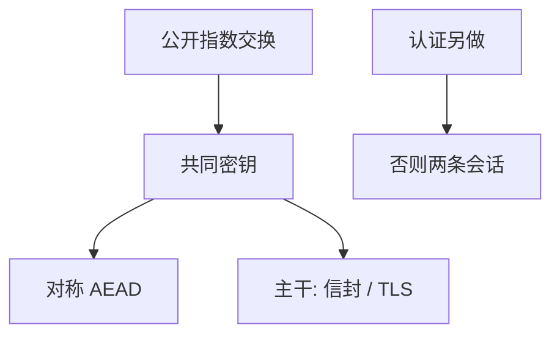

# Diffie–Hellman

公开两指数运算，使没有预共享秘密的双方得到共同密钥；认证仍要另做，否则中间人各握一钥。

<footer>—— Diffie and Hellman, New Directions in Cryptography, IEEE Trans. Info. Theory 1976</footer>

[上一课](/cs/gray-transactions)附录对照了关系模型原文。附录对照，不插入主干。主干已在[公钥与信封](/cs/pubkey-envelope)、[TLS 握手](/cs/tls-handshake)、[中间人](/cs/mitm)里用过密钥协商与假冒几何；这里对照 **1976 原文的问题**：公钥方向——加密与认证能否不先送对称钥，陷门单向函数作为设想。不重做离散对数。

## 问题

Shannon 1949 保密论默认共享密钥。主干对称课停在 AEAD。Diffie–Hellman 的缺口是公开密钥学：公钥可公布，DH 交换得到共同秘密，数字签名使认证可不共享 MAC 键。RSA 同年稍后另文；本附录只钉 1976 的方向，不把分解模数插进来当证明。

原文已警告未认证交换的假冒。主干中间人课取的就是这一警告。Goldwasser–Micali 语义安全是后续命名，主干已用名字，不伪造论文页码。

## 方法

公开素数与生成元；各方选指数，交换 $g^a$、$g^b$，共享 $g^{ab}$。前向保密来自临时指数，是后来工程对这篇的用法（TLS 1.3 ECDHE），不是 1976 的 TLS。签名与公钥加密在原文是同一方向的另两块。

## 机制

计算假设（离散对数难）把「看见报文」与「得到 $k$」切开，服务威胁模型里的被动者。主动者要证书或预共享，主干 PKI 课已接。量子算法对 DH 的冲击是后话，主干不插入替换课。

### 为何对照而不插入主干

安全课从 CIA 与威胁模型进入，先对称后公钥，因为会话数据走对称。把 1976 插在 CIA 之前，读者会以为安全等于公钥。附录只对照方向的出处。

## 边界

不要把 1976 与 Merkle 密钥分配、与 RSA 专利史写成一课。下一篇对照 Patterson/Hennessy 如何把体系结构收成量化教材，那是流水线与 Cache 主干的文献。

认证加密与 DH 是不同层：DH 给共享秘密，AEAD 用它保护字节。主干已按这个顺序上课。

对照结束应回到主干[公钥与信封](/cs/pubkey-envelope)与[中间人](/cs/mitm)。1976 文不插入 CIA 之前。

## 小结

- 附录对照 Diffie–Hellman 1976：公开密钥方向与 DH 共享秘密。
- 主干信封、TLS、中间人课已取用；认证不是 DH 自动附赠。
- 不插入 CIA 课之前。
- 出处：Diffie and Hellman, *IEEE TIT* 22(6), 1976。
