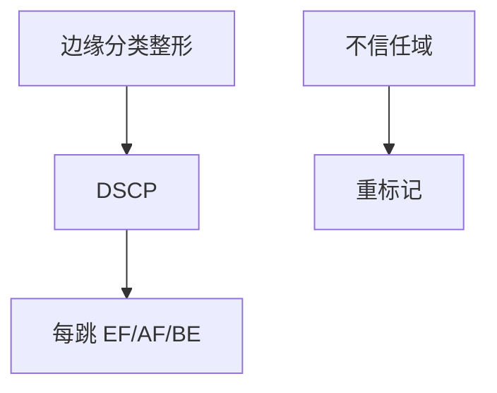

# DiffServ

DSCP 把包分到少量行为聚集，每跳 PHB（EF/AF/BE）执行；可扩展，但不在互联网上承诺端到端预留。

<footer>—— 据 RFC 2474 / 2475 DiffServ；RFC 3246 EF；RFC 2597 AF 整理</footer>

[WFQ](/cs/wfq-fair-queue) 每流不扩展。[令牌桶](/cs/token-bucket-shaping) 可按类。[上一课](/cs/token-bucket-shaping) 留下着色。缺口是 **DiffServ 架构**：标记、PHB、边界信任。本课不把 TSO 写完。

## 问题

IntServ/RSVP 每流预留在核心炸状态。DiffServ：边缘分类打 DSCP，核心只看 6 比特做 EF（低延迟）、AF（分档丢弃）、BE。无端到端硬合同，除非域内 SLA。与 5G 切片对照：切片是硬隔离实例，DSCP 是软着色。PFC 用 802.1p，要在边缘映射到 DSCP。

不要把 EF 写成 URLLC 保证：没有资源预留则 EF 也会挤。

RFC 2475 框架。核心「简」是可扩展理由。本课不把 64 个码点背完。

### 域内着色

少量 PHB 可扩展，无全球预留。IXP 常重标记。EF 无资源也会挤。主机乱打 EF 会被边缘改写。

## 方法

画：边缘分类+桶 → DSCP → 核心 PHB。对照 EVPN/QoS：租户类在覆盖内外要映射。IXP 通常不信你的 DSCP，会重置。

方法止于选定对象与对照；机制才说它如何嵌入已有分层与主干课。

## 机制

AQM 可按 AF 颜色丢。ECN 与 DSCP 正交（ECN 用 TOS 低 2 位历史纠缠，实现要小心）。BGP 不传 DSCP 政策。RoCE 依赖边缘信任的优先级，跨域失效。

与 Saltzer：DiffServ 是性能，不是正确性。

## 边界

本课不引入 RSVP-TE 与 DiffServ-TE 的全部。TSO/LRO 是下一课。后课默认：公网尽力而为；DSCP 在单一信任域内有意义。

主机随意打 EF 会被边缘改写。

上一课留下的缺口在本课收口；「DiffServ」进入后课词汇表后只引用。文献用来钉对象与边界，不把本课写成该主题的独立综述。下一课[TSO / LRO](/cs/tso-lro)。

## 小结

- 少量 PHB 换可扩展 QoS。
- 合同在域边界，不在全球。
- 与切片、PFC 映射但不等价。
- 后课只引用本课钉死的对象，不从该领域总问题重开。
- 出处：RFC 2474/2475；RFC 3246。
