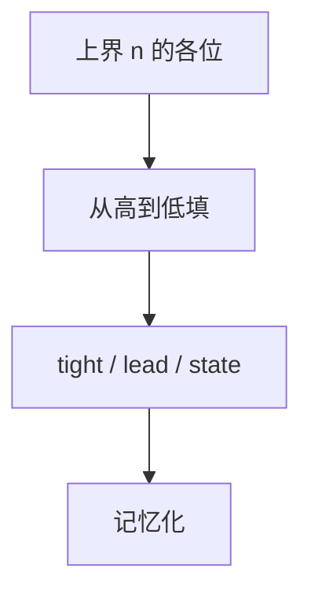

# 数位 DP

把 $[0,n]$ 的计数写成沿十进制位的自动机 DP：是否贴上界、是否前导零、以及题目要的模或数字特征。

<footer>—— 据数字位 DP 的标准教材技法；自动机计数对照[KMP](/cs/kmp) 整理</footer>

上一课[树形 DP](/cs/tree-dp)沿树边。本课对象是整数的十进制（或 $b$ 进制）写法。缺口是数位 DP：`dfs(pos, tight, lead, state)` 记忆化。不重写树合并。后课单调队列优化换转移形状。

## 问题

计 $[l,r]$ 中满足性质的个数 $=F(r)-F(l-1)$。$F(n)$：从高位填，`tight` 表示是否等于 $n$ 的前缀；`lead` 前导零；`state` 为模、是否出现 49、与模式串匹配等。位数 $O(\log n)$，状态乘 tight/lead 仍小。

缺口是这台自动机，不是 Lucas 模 $p$ 组合数（那是另一计数）。

### 前导零不是装饰

「含数字 0 的个数」对前导零敏感。`lead` 要把未真正开始的位数排除。不要漏。

数位 DP 是竞赛标准。与自动机：KMP 失败函数可做 `state`。后课单调队列优化数值 DP 转移，不是位数。

## 方法

拆位数组。记忆化。进制 $b$ 同构。区间减。性质用 `state` 压缩。

无上界（无穷）不适合本模板。

## 机制

贴界时下一数字上限为 $n$ 的该位，否则 $0..b-1$。与生成函数：数位 DP 是有限自动机接受的整数计数。与状压：掩码可做 `state`（出现过的数字集合）。

## 边界

本课不写 $n$ 为 $10^{10^6}$ 的大数位（要矩阵或自动机最短路）。后课默认：$[l,r]$ 数字性质用数位 DP。下一课单调队列优化。

## 小结

- $F(r)-F(l-1)$；沿位、贴界、前导零。
- `state` 编码性质或自动机。
- 位数对数，状态要小。
- 出处：数位 DP 标准技法；自动机见 Knuth–Morris–Pratt 思想。
