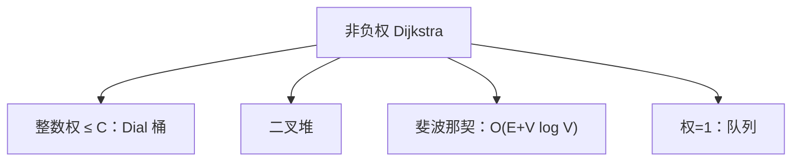

# Dial 与堆变体

Extract-Min 的实现决定 Dijkstra 的渐近：整数权可用桶，一般非负权用堆；斐波那契堆把减键摊还到均摊常数。

<footer>—— 据 Dial, Algorithm 360, 1969；Fredman and Tarjan, Fibonacci heaps and their uses, 1987；CLRS 第 24 章整理</footer>

上一课[Dijkstra](/cs/dijkstra)钉死非负权上的贪心取出：一旦 Extract-Min 得到 $u$，$d[u]=\delta(s,u)$。实现随口说了二叉堆 $O((V+E)\log V)$。本课不重证那条不变式。缺口是**优先队列怎么做**：扫描数组、二叉堆、Dial 桶、斐波那契堆，各在什么权上合法。后课负边仍禁止这些加速。

## 问题

朴素每次扫 $V$ 个 $d$ 值，$O(V^2+E)$，稠密图合适。稀疏图要用堆：`Decrease-Key` 对应松弛成功。二叉堆上减键 $O(\log V)$，总 $O((V+E)\log V)$。若边权是 $\{0,1,\ldots,C\}$ 上的整数，Dial：按当前距离把顶点放进 $C+1$ 个循环桶，Extract-Min 是扫桶，单调性来自非负权下 $d$ 只增且步长 $\le C$。时间 $O(E+VC)$。缺口是把「堆」从算法定义里拆出来。

斐波那契堆：Extract-Min 均摊 $O(\log V)$，Decrease-Key 均摊 $O(1)$，故 $O(E+V\log V)$。常数大，课内记上界，实现默认二叉堆。

### Dial 不是 BFS 队列

权为 $1$ 时 Dial 退化成按层扫，与 BFS 同类，但桶是为整数权准备的。负权仍会破坏取出即钉死，换桶没有用。不要对负权实例「换一个更快的堆」。

Dial 1969 的桶用于整数权最短路。Fredman–Tarjan 1987 用斐波那契堆改进多种图算法。CLRS 24.3 把实现参数化成优先队列。本课不手写斐波那契堆的级联切断。

## 方法

先确认权 $\ge 0$。整数且 $C$ 不大：Dial。一般：二叉堆。要写紧的稀疏上界：斐波那契。权全 $1$：退回[无权 BFS](/cs/bfs-unweighted)，不要堆。

正确性全部继承上一课；变的只是取出与减键的代价。减键需要堆内句柄，邻接表顶点要能找到堆节点。

## 机制

单调桶依赖 $d[u]$ 被钉死后不会再减，且新松弛值 $\ge d[u]$。这就是非负。势能分析（斐波那契）与[摊还](/cs/amortized-analysis)同类，本课不重写势函数。全源非负稀疏图：$V$ 次本算法，堆的选择会被乘 $V$ 倍——[Johnson](/cs/johnson-apsp) 再收。

## 边界

本课不处理负边、不写 $A^*$。桶宽 $C$ 随输入指数时 Dial 并不多项式于位数，与背包伪多项式同类，点名即可。后课默认：非负单源实现按权选择队列；负权入口是 Bellman–Ford，不能减键加速。

## 小结

- Dijkstra 的渐近 = Extract-Min / Decrease-Key 的代价。
- 整数权 Dial；$1$ 权 BFS；一般二叉堆；紧界斐波那契。
- 负权使取出即钉死失败，换堆无效。
- 出处：Dial, 1969；Fredman and Tarjan, 1987；CLRS 第 24.3 节。
