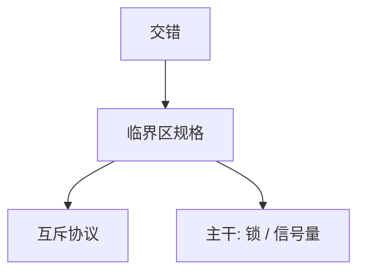

# Dijkstra 互斥

并发进程要合作使用临界资源；互斥、进展与有限等待可以先写成命题，再谈锁的实现。

<footer>—— Dijkstra, Solution of a Problem in Concurrent Programming Control, CACM 1965；对照 EWD 与信号量后来的讲义</footer>

[上一课](/cs/knuth-taocp)附录对照了顺序算法的分析。附录对照，不插入主干。主干已在[竞争与临界区](/cs/knuth-taocp)、[锁与关中断](/cs/lock-irq)、[信号量](/cs/semaphore)里用过临界区；这里对照 **1965 短文的问题**：不靠特殊原子指令以外的「谁先写标志」，能否正确互斥。不重做 Peterson 的逐行证明。

## 问题

Knuth 式分析默认单线程步数。一旦两个控制流交错，[循环不变式](/cs/loop-invariant)要对所有交错成立。Dijkstra 1965 针对的是临界区：一次至多一个进程在里面。后来的信号量、管程是同一问题的抽象升级，主干已经分开上课。附录只对照原文把互斥当成可发表的正确性问题。

Dekker 算法更早；Dijkstra 把问题陈述标准化。硬件原子（test-and-set）把实现变简单，但不取消「临界区规格」。主干锁课用关中断与原子，1965 文更在软件标志。

## 方法

写出互斥、无死锁、公平性一类命题，给共享变量协议。主干用锁 API 把协议藏进内核；附录对照：规格先于 `lock()` 这个词。信号量（Dijkstra 后来的 P/V）把睡与醒做成原语，主干信号量课已取用。

## 机制

一旦互斥是命题，死锁四条件、管程、数据库 2PL 都是同一家族在不同对象上的投影。1965 文不管持久化、不管分布式故障。数据库[库内死锁](/cs/db-deadlock)课已经声明与 OS 同构；本附录不把 2PL 写回 1965。

### 为何对照而不插入主干

若把 1965 插在线程课之前当第一课并发，读者会先学 Dekker 再学进程。主干先有进程映像与调度，再有竞争。附录只对照「并发正确性可以先写规格」。

## 边界

不要把 1968 年 THE 系统与 1965 短文混成一篇。也不要在此展开线性化与内存模型——主干[存储一致性](/cs/memory-consistency)另有位置。下一篇对照 Lamport 1978 如何在没有共享内存的机器上谈「先于」。

饥饿与公平是 1965 文之后逐步写清的；主干锁课用「进展」而不是把公平算法插进第一课同步。

对照结束应回到主干[竞争与临界区](/cs/race-critical)与[信号量](/cs/semaphore)。1965 短文不插入进程映像之前。

## 小结
- 附录对照，不插入主干。
- 下一篇对照 Lamport 1978 逻辑时钟。

- 附录对照 Dijkstra 1965：临界区作为可证明的合作问题。
- 主干锁与信号量课已取用规格；本篇不插入线程课之前。
- 无共享内存的次序是 Lamport 时钟附录。
- 出处：Dijkstra, *CACM* 8(9), 1965。
