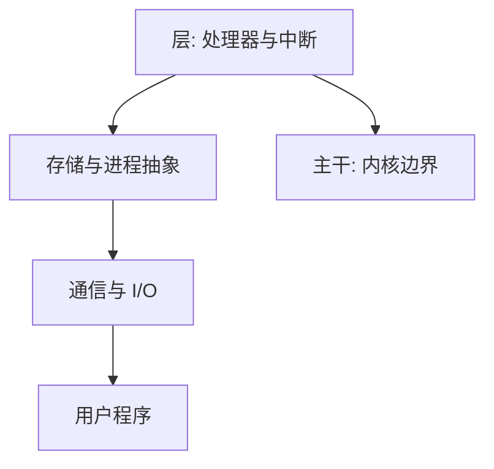

# Dijkstra THE 多层

把多道程序系统收成严格分层：每层只使用下层已经证明的抽象，处理器、存储器与用户进程各有一层。

<footer>—— Dijkstra, The Structure of the THE Multiprogramming System, CACM 1968</footer>

[上一课](/cs/dijkstra-mutex)附录对照了 1965 年临界区短文。附录对照，不插入主干。主干已在[内核与用户态](/cs/kernel-user)、[进程映像](/cs/process-image)、[信号量](/cs/semaphore)里用过分层抽象与 P/V；这里对照 **THE 系统原文的问题**：如何把一台多道机器建成可推理的层，而不是一堆互相调用的例程。不重做 CFS，也不把本篇插回进程课之前。

## 问题

1965 文给出互斥规格，不管整机结构。THE 的缺口是系统：层 0 处理中断与处理器分配，之上存储、通信、I/O、用户程序，每层只看见下层的接口。信号量在文中作为层间同步。主干 OS 课按映像、调度、虚存、文件走，并不采用 THE 的层号当课序。附录只对照「分层使正确性可逐层谈」。

THE 是 Eindhoven 的系统名（Technische Hogeschool Eindhoven），不是英语定冠词游戏。层次与后来微内核不是同一场辩论；Tanenbaum 对照更后。

## 方法

自底向上：先保证中断与时钟，再保证段与进程不会破坏下层不变量。测试与「层次证明」的叙事是原文风格：先让下层无错，上层才能当它为公理。主干[特权级](/cs/privilege-rings)用硬件级实现类似的不可逾越；THE 更多是软件结构。

## 机制

分层把[完整中介](/cs/toctou) 做成结构：上层无法直接踩时钟与中断屏蔽。信号量把 1965 的临界区收成可组合原语，主干信号量课已取用。THE 不管关系模型、不管 TCP。

### 为何对照而不插入主干

若把 1968 插在互斥规格之后当「下一课 OS」，读者会按 THE 层号上课，而本栏 OS 第一课接运行时与进程映像。附录只对照分层作为可发表的系统结构，下一篇才把「先于」收到无共享内存的消息上。

## 边界

不要把 THE 与 1965 短文混成一篇——上一附录已警告。也不要在此展开微内核消息。下一篇对照 Lamport 1978 逻辑时钟。

对照结束应回到主干[进程映像](/cs/process-image)与[信号量](/cs/semaphore)。THE 层号不插入课序。

## 小结

- 附录对照 Dijkstra 1968 THE：多道系统的严格分层。
- 主干内核与信号量课已取用抽象；本篇不插入进程课之前。
- 出处：Dijkstra, *CACM* 1968。
