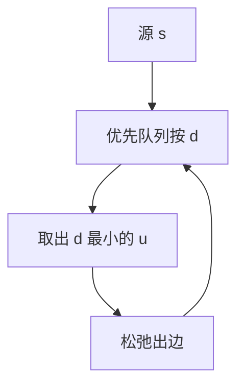

# Dijkstra

非负边权上，每次把估计最小的未确定顶点钉死；松弛不会再减小它。

<footer>—— 据 Dijkstra, A Note on Two Problems in Connexion with Graphs, 1959；CLRS 第 24 章整理</footer>

上一课[拓扑排序](/cs/topo-sort)给了 DAG 上的线性序，但一般有向图可以有环，边还可以带**非负**权。BFS 只处理权为 $1$。本课不重做队列分层。缺口是：把「当前最近的未确定点」用[优先队列](/cs/heap-priority)选出，并证明一旦取出，距离不再变。本课只处理单源、权 $\ge 0$。

## 问题

$d[v]$ 是当前从 $s$ 到 $v$ 的上界。松弛边 $(u,v)$：若 $d[v]\gt d[u]+w(u,v)$ 则更新。BFS 的正确性依赖层数；权不等时层数不是路径权。缺口是集合 $S$：已取出的顶点。不变式：$u\in S$ 则 $d[u]=\delta(s,u)$。每次从 $V\setminus S$ 取 $d$ 最小者加入——非负权保证没有更短的路会从 $V\setminus S$ 绕回来把它改小。

负权使这条论证失败：更短的路可以晚到。那是下一课 Bellman–Ford。本课也不做全源。

### 二叉堆不是算法本身

算法是贪心取出加松弛。实现用二叉堆时 $O((V+E)\log V)$；斐波那契堆 $O(E+V\log V)$。邻接矩阵加扫描最小 $d$ 是 $O(V^2)$。课程主干记二叉堆；不要把堆当成 Dijkstra 的定义。

Dijkstra 1959 原文同时谈最短路与最小生成树的一种过程。CLRS 把非负单源写成 Extract-Min 循环。贪心正确性的一般模板在后课，本课先把这条特例钉死。

## 方法

$d[s]=0$，其余 $\infty$。$Q$ 为优先队列。循环：取出 $u$，对每条出边松弛。终止 $Q$ 空。不可达点保持 $\infty$。

正确性：非负权 + 循环不变式。不要对负权实例「再跑一遍 Dijkstra」。

## 机制

前驱 $\pi$ 给出一条最短路树。与 BFS：权全 $1$ 时 Extract-Min 的次序与队列一致，Dijkstra 退化成 BFS，但堆的对数因子仍在，实现上应换回队列。DAG 上按拓扑松弛是 $O(V+E)$，不必堆——那是拓扑课留下的用法，本课处理有环非负。

## 边界

负环、负边一律不保证。全源用后课 Floyd 或 $V$ 次本算法（仍要非负）。启发式 $A^*$ 是一致势函数下的同一骨架，本课不引入。点权可化成边权，不另开算法。

后课默认：非负单源 = Dijkstra；实现默认二叉堆。负权入口是 Bellman–Ford。

## 小结

- 非负权下 Extract-Min 钉死最短距离。
- 二叉堆 $O((V+E)\log V)$；权为 $1$ 应退回 BFS。
- 负边使不变式失效。
- 出处：Dijkstra, 1959；CLRS 第 24.3 节。
