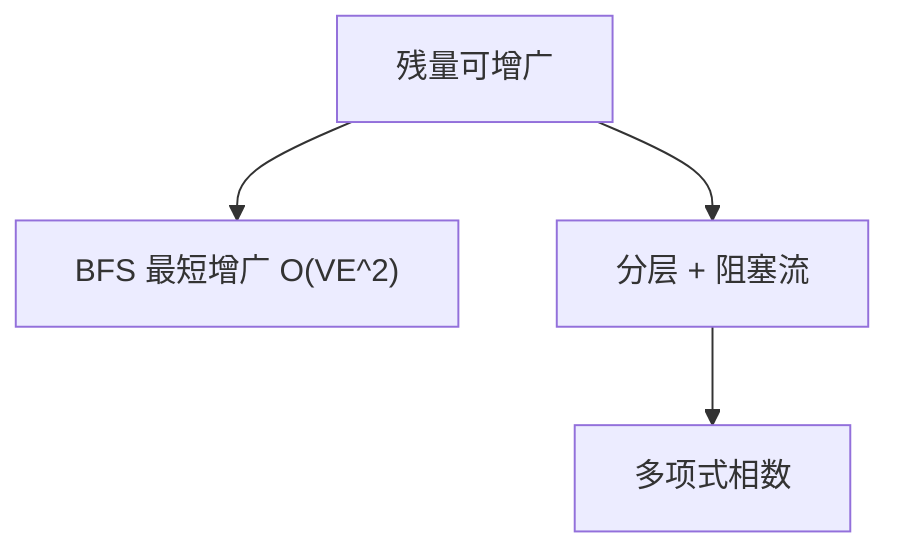

# Edmonds–Karp 与 Dinic

最短增广把 Ford–Fulkerson 变成 $O(VE^2)$；分层网络上的阻塞流把迭代降到 $O(V^2 E)$。

<footer>—— 据 Edmonds and Karp, Theoretical Improvements in Algorithmic Efficiency for Network Flow Problems, 1972；Dinic, Algorithm for Solution of a Problem of Maximum Flow, 1970；CLRS 第 26 章整理</footer>

上一课[最大流 Ford–Fulkerson](/cs/max-flow-ff)给出残量增广与最大流最小割，并警告：任意增广路可使次数随容量指数。本课不重证割。缺口是**选哪条路**：Edmonds–Karp 每次 BFS 最短（边数最少）增广；Dinic 一次建分层，再推阻塞流。整数容量下二者都多项式。后课二分图匹配把单位容量网络当特例。

## 问题

Ford–Fulkerson 是框架。容量很大且每次 $\Delta=1$ 时，增广次数可达 $\Theta(|f^*|)$。Edmonds–Karp：残量上 BFS 找 $s$–$t$ 最短路再增。关键事实：最短路长度不减，每条边作为临界边的次数 $O(V)$，故增广 $O(VE)$ 次，每次 $O(E)$，总 $O(VE^2)$。缺口是这份选路规则，不是新的流定义。

Dinic：按残量 BFS 分层，$d(v)$ 为边数距离。只沿层间边 $d(w)=d(v)+1$ 推流，直到 $s$ 到 $t$ 不再连通（阻塞流）。然后重建分层。层数增加，至多 $V-1$ 相。单位容量或简单图上实现可到 $O(V^2 E)$ 量级（经典界）；更紧的实现不在本课展开。

### 阻塞流不是一次增广

一次阻塞流可以同时填满分层里的许多条路，相当于一批最短增广。Dinic 1970 的「功率」估计即分层推进。不要把 Dinic 写成「再跑一遍 Edmonds–Karp」。

Edmonds–Karp 1972 证明最短增广多项式。Dinic（Dinitz）1970 更早给出分层。CLRS 以 Edmonds–Karp 为定理级实现，Dinic 作进阶。本课两条都要：一条证明墙是多项式，一条给更常用的推进。

## 方法

EK：循环 BFS，沿树增广，更新残量，直至 $t$ 不可达。Dinic：循环 { BFS 分层；若 $t$ 不在分层则停；DFS/指针沿层推阻塞流 }。

容量有理先化为整数。无理容量仍可能病态，主干用整数。

## 机制

最短增广使「距离标号」单调，分析才能数临界边。Dinic 的当前弧优化避免反复扫邻接表，是实现零件，不改变分层正确性。单位容量网络（匹配）上界更好，下一课用，本课不把匹配写完。

不要在有负容量的「流」上套本课；模型仍是上一课的容量约束与守恒。

## 边界

本课不写推送重标、不写费用流。最小割在增广结束时仍是 $s$ 侧可达集。后课默认：要多项式最坏，最短增广或 Dinic；二分图匹配化成单位容量最大流。

## 小结

- Edmonds–Karp：最短增广，$O(VE^2)$。
- Dinic：分层阻塞流，相数 $O(V)$。
- 仍是残量增广；选路决定次数。
- 出处：Dinic, 1970；Edmonds and Karp, 1972；CLRS 第 26 章。
