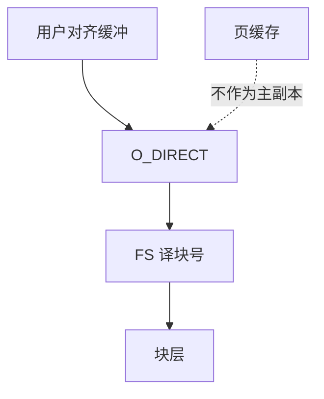

# O_DIRECT

O_DIRECT 让读写尽量绕过页缓存，缓冲必须按设备与文件系统对齐；内核不再为你做那层统一帧。

<footer>—— 据 Linux open(2) 对 O_DIRECT 的说明；数据库与 <em>OSTEP</em> 对双缓存问题的讨论</footer>

[上一课](/cs/readahead)把页缓存用满。[mmap 一致](/cs/fs-mmap-coherence) 的前提是「内核持有那一帧」。数据库、虚拟机盘后端常自己做缓冲池，再走内核会**双缓存**。缺口是 `O_DIRECT`：语义、对齐、与 fsync 的残余。

## 问题

`open(..., O_DIRECT)`：`read`/`write` 用户缓冲直达块层（仍可能经 FS 映射成块号）。缓冲地址、长度、偏移通常需对齐到逻辑块。缺口：是否保证绕过所有缓存（控制器缓存仍在）；与同时 `mmap` 同一文件是否一致（Linux 不保证）；`O_DIRECT` 不是 `O_SYNC`——持久仍要 [fsync](/cs/fsync) 或 `O_DSYNC`。本课不把 `io_uring` 注册缓冲提前写完。

对齐失败返回 EINVAL。文件系统可对 DIRECT 回退到缓冲 I/O——可移植程序不能假设绝对绕过。本课以 Linux 常见行为为准。

## 方法

写：内核把用户页映射给块请求（或 bounce），不插入 inode 页树（或立即失效相关页）。读：DMA 进用户页。对照 [tmpfs](/cs/tmpfs)：直接 I/O 对纯内存 FS 意义不同，常被拒绝或退化。对照 NFS：DIRECT 削弱客户端缓存，RPC 仍在。预读不适用于这条路径。

## 机制

O_DIRECT 把「统一页缓存」从强制变成可选：应用愿承担对齐与失效，换回控制与内存。它不是更快的同义词——小请求会更慢。不要把本课写成存储产品的「直通」广告。与设备节点：对块设备同样适用，虚拟机常用。

一致性：混用缓冲 I/O 与 DIRECT 是未定义窗口；课序要求选一条主路径。

实现上：DIRECT 与缓冲 I/O 混用时，页缓存中的旧帧不会自动失效成应用以为的「盘上最新」。对齐要求随逻辑块与 DMA 限制变，文件系统可对未对齐请求回退，可移植程序必须处理 EINVAL。 读法上只引用[上一课](/cs/readahead)的结论，不把对象换成训练推理或限价簿。

本课在操作系统进阶的「文件系统实现 / 接口进阶」课序里，对象是 **O_DIRECT**。

- 先修只引用，不重导：上一课的结论当公理，本课只补差。
- 五栏不吞并：不把本课写成大模型训练/推理，也不写成限价簿或权重量化。
- 文献用 OSTEP、McKusick、内核文档与具名会议论文；不发明 arXiv 编号。

## 边界

本课不引入 SCSI 保护信息、T10 DIF。不保证每台 NAS 的 DIRECT 语义。下一课把「等待完成」从同步 read 换成 POSIX 异步 I/O。

版本字段会变，课序钉的是机制对象「O_DIRECT」，不是某一主线内核的结构体名。
后课默认：可绕过页缓存，但要对齐且自管一致性。异步提交与完成队列，下一课 POSIX AIO。

## 小结

- O_DIRECT 绕过（尽量）页缓存，要求对齐。
- 它不是 fsync；与 mmap 混用危险。
- POSIX AIO 是下一课。
- 出处：Linux `open(2)`；*OSTEP*；Silberschatz *OSC* 对直接 I/O 的背景。
