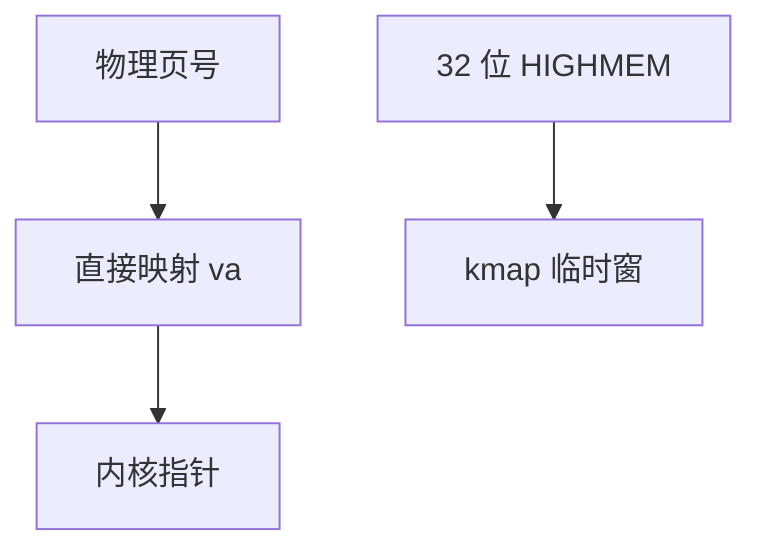

# 直接映射与高端内存

直接映射把物理内存线性映进内核虚址，pfn 与 va 可算术互转；32 位高内存超出该窗口，必须临时 kmap。

<footer>—— 据 Gorman；Bovet and Cesati 对 ZONE_HIGHMEM 的整理；Linux 内存模型文档</footer>

[vmalloc](/cs/vmalloc) 是稀疏内核映射。[用户/内核分裂](/cs/user-kernel-split) 已有高半。缺口是 **线性映射（direct map）** 与历史 **HIGHMEM**：为何 64 位几乎不再提高端，以及安全上 direct map 别名。

## 问题

内核常要「页框 → 可解引用指针」。direct map：`page_address` 即 va。32 位 4G 虚空间要分给用户，线性窗口盖不住全部 RAM → HIGHMEM，访问用 `kmap`。64 位 canonical 空间足够，HIGHMEM 消失。缺口：direct map 与用户映射同一页造成别名，[KPTI](/cs/kpti-os) 与加固后课会动这份映射。本课不把每架构的起始地址当考纲。

huge 线性映射用大页覆盖 DRAM，省 TLB。加密内存、kfence 可能拆开部分线性映射。

## 方法

分配页后内核用 `page_to_virt` 写。DMA coherent 也常靠这。HIGHMEM：kmap 在固定窗口建临时 pte。对照 vmalloc：direct map 覆盖全部（64 位）物理，vmalloc 是额外窗口。对照 DAX：用户直接映射 PMEM，内核仍有自己的 map。

## 机制

线性映射让内核把 RAM 当大数组，是伙伴分配器实现的前提。HIGHMEM 是 32 位的补丁课，今日仍在旧嵌入式出现。不要写成 x86 分段课。与热插拔：新内存要纳入线性映射或稀疏 memmap。

别名：同一页框两个 va（用户+direct）在缓存别名架构上要命；x86 较宽松，仍有安全含义。

实现上：线性映射用大页覆盖能显著减内核 TLB miss。KASLR 随机化内核映像但不随机整份直映。HIGHMEM 的 kmap 窗口有限，嵌套 kmap 要按类型取。 读法上只引用[上一课](/cs/vmalloc)的结论，不把对象换成训练推理或限价簿。

本课在操作系统进阶的「内存进阶 / 回收、迁移与加固」课序里，对象是 **直接映射与高端内存**。

- 先修只引用，不重导：上一课的结论当公理，本课只补差。
- 五栏不吞并：不把本课写成大模型训练/推理，也不写成限价簿或权重量化。
- 文献用 OSTEP、McKusick、内核文档与具名会议论文；不发明 arXiv 编号。

## 边界

本课不引入 MIPS 缓存别名的全部。不保证 confidential computing 下的共享 direct map。下一课为侧信道拆用户页表里的内核：KPTI。

版本字段会变，课序钉的是机制对象「直接映射与高端内存」，不是某一主线内核的结构体名。
后课默认：内核经线性映射碰页框。用户页表是否包含内核，下一课 KPTI。

## 小结

- 直接映射：pfn 与内核 va 线性对应。
- HIGHMEM 是 32 位窗口不足的产物。
- KPTI 是下一课。
- 出处：Gorman；*ULK*；Linux memory models。
