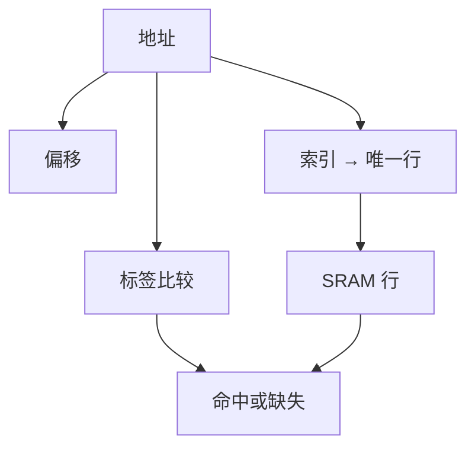

# 直接映射 Cache

用地址的中间几位选一行、高位当标签，SRAM 才能在一拍里回答「这块在不在」。

<footer>—— 据 Patterson and Hennessy, Computer Organization and Design (RISC-V) 整理</footer>

[上一课](/cs/locality-principle)钉死了时间与空间局部性，并指出平均访存时间依赖命中。[SRAM 与 DRAM 阵列](/cs/locality-principle)给出两种阵列。本课不重讲局部性定义。缺口是：还没有一种硬件结构，能按地址在 SRAM 里查找最近用过的块。本课只交出直接映射：每个主存块只能放进唯一一行。

## 问题

局部性说「该留下最近的块」，没说块怎么编号、怎么判定命中。若每条 load 都把地址与全部 SRAM 内容比较，比较器会比 DRAM 还慢。缺口不是再买更大的 DRAM，而是**把地址切成标签、索引、块内偏移**，用索引做阵列寻址，只用标签做相等比较。

空间局部性要求块大于一个字：一次缺失把邻近字一并取来。本课取块大小为 $2^b$ 字节，不讨论写策略。

直接映射是相联度 1：冲突时只能踢掉那一行上的唯一块。组相联是下一课。

## 方法

设 cache 有 $2^n$ 行，每行一块。地址低 $b$ 位是块内偏移，接着 $n$ 位是索引，其余高位是标签。访问时读出该行的标签与有效位，与地址标签比较：相等则命中，用偏移选字；否则缺失，从 DRAM 填入该行，改标签。

一行还要有效位。本课暂不设脏位——那是写回课才需要的。取指与数据可以各用一个直接映射阵列，对应上一课结构冒险里的分体存储。

## 机制

命中路径是 SRAM 读加比较，延迟按 cache 命中时间进 CPI。缺失则停顿流水线，付 DRAM 块传输代价。两个经常一起用、但索引相同、标签不同的块会反复互踢：这是冲突，不是容量不够。本课只承认会发生；分类在缺失分类课。

直接映射的硬件最简单：无需在一行里选路，也无需替换策略——能放的位置只有一个。这是它作为第一课 cache 的理由。

## 边界

本课不引入多路、不引入 LRU，不处理写命中是写 SRAM 还是写 DRAM。也不把 cache 做成程序员可见的 ISA 对象：地址仍是字节地址，命中对软件透明。一致性尚未进场。

后课默认：谈到 cache，先有标签、索引、偏移和有效位。直接映射是相联度 1 的特例。

## 小结

- 地址切成标签 / 索引 / 偏移；索引选定唯一行。
- 命中比较标签；缺失从 DRAM 填该行。
- 组相联、写策略、三类缺失是后课的缺口。
- 出处：Patterson and Hennessy, *COD* RISC-V cache 章。
