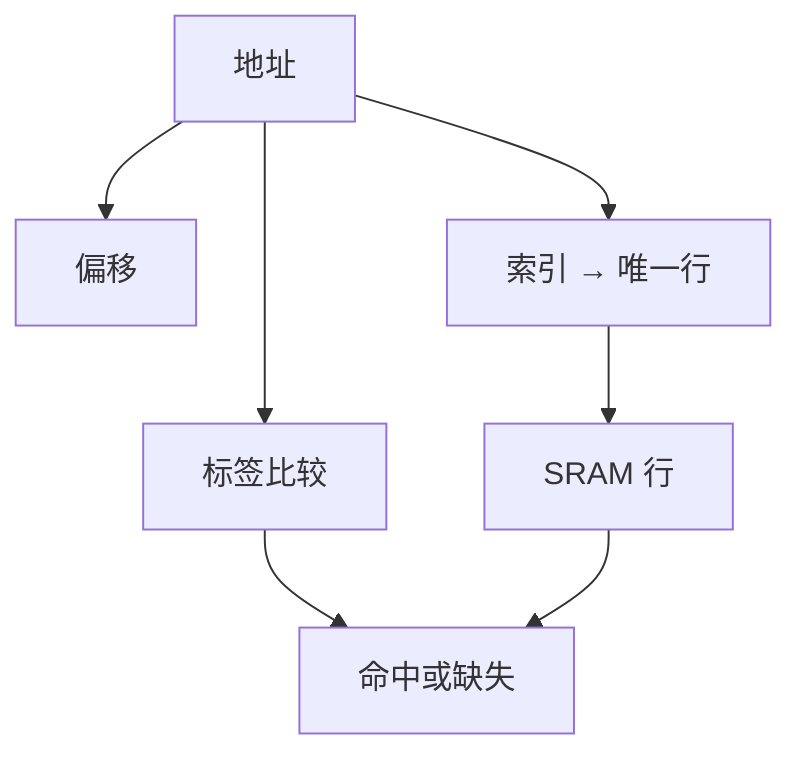
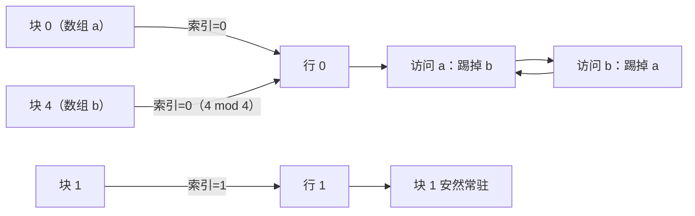

# 直接映射 Cache

用地址的中间几位选一行、高位当标签，SRAM 才能在一拍里回答「这块在不在」。

<footer>—— 据 Patterson and Hennessy, Computer Organization and Design (RISC-V) 整理</footer>

[上一课](/cs/locality-principle)钉死了时间与空间局部性，并指出平均访存时间依赖命中。[SRAM 与 DRAM 阵列](/cs/memory-array-sram-dram)给出两种阵列。本课不重讲局部性定义。缺口是：还没有一种硬件结构，能按地址在 SRAM 里查找最近用过的块。本课只交出直接映射：每个主存块只能放进唯一一行。

## 问题

局部性说「该留下最近的块」，没说块怎么编号、怎么判定命中。若每条 load 都把地址与全部 SRAM 内容比较，比较器会比 DRAM 还慢。缺口不是再买更大的 DRAM，而是**把地址切成标签、索引、块内偏移**，用索引做阵列寻址，只用标签做相等比较。

空间局部性要求块大于一个字：一次缺失把邻近字一并取来。本课取块大小为 $2^b$ 字节，不讨论写策略。

直接映射是相联度 1：冲突时只能踢掉那一行上的唯一块。组相联是下一课。

直觉类比：索引像停车场的车位号——地址直接算出「只能停几号位」；标签像车牌，访问时只核对「这个位上停的是不是我要的那辆车」。好处是只查一个车位、一拍出结果；代价是两辆常一起用的车若被分到同一车位号，就会不停互相顶走。

## 方法

设 cache 有 $2^n$ 行，每行一块。地址低 $b$ 位是块内偏移，接着 $n$ 位是索引，其余高位是标签。访问时读出该行的标签与有效位，与地址标签比较：相等则命中，用偏移选字；否则缺失，从 DRAM 填入该行，改标签。

```mermaid
flowchart TD
  ADDR["地址"] --> OFF["偏移"]
  ADDR --> IDX["索引 → 唯一行"]
  ADDR --> TAG["标签比较"]
  IDX --> ROW["SRAM 行"]
  TAG --> HIT["命中或缺失"]
  ROW --> HIT
```

一行还要有效位。本课暂不设脏位——那是写回课才需要的。取指与数据可以各用一个直接映射阵列，对应上一课结构冒险里的分体存储。

## 机制

命中路径是 SRAM 读加比较，延迟按 cache 命中时间进 CPI。缺失则停顿流水线，付 DRAM 块传输代价。两个经常一起用、但索引相同、标签不同的块会反复互踢：这是冲突，不是容量不够。本课只承认会发生；分类在缺失分类课。

直接映射的硬件最简单：无需在一行里选路，也无需替换策略——能放的位置只有一个。这是它作为第一课 cache 的理由。

```mermaid
flowchart LR
  B0["块 0（数组 a）"] -->|"索引=0"| R0["行 0"]
  B4["块 4（数组 b）"] -->|"索引=0（4 mod 4）"| R0
  B1["块 1"] -->|"索引=1"| R1["行 1"]
  R0 --> T1["访问 a：踢掉 b"] --> T2["访问 b：踢掉 a"] --> T1
  R1 --> OK["块 1 安然常驻"]
```

这张图回答「冲突缺失为什么在 cache 远没装满时也会发生」：4 行 cache、块大小 16 B 时，块 0 与块 4 的索引同为 $0 \bmod 4 = 0$，只能轮流占行 0——哪怕其余 3 行全空着。数字实例：循环里交替读一次 `a[i]`、读一次 `b[i]`，若二者恰好隔了 4 个块，就是每次访问都缺失的「乒乓」。

常见误区：初学者看到程序慢、缺失多，第一反应是「cache 太小」。实际上一类缺失叫冲突缺失：把其中一个数组首地址挪开几十字节（padding），或改成组相联，性能立刻恢复，容量一个字节都没加。判断依据是「互踢的两块是否索引相同」，不是看总占用有没有超过容量。

## 边界

本课不引入多路、不引入 LRU，不处理写命中是写 SRAM 还是写 DRAM。也不把 cache 做成程序员可见的 ISA 对象：地址仍是字节地址，命中对软件透明。一致性尚未进场。

后课默认：谈到 cache，先有标签、索引、偏移和有效位。直接映射是相联度 1 的特例。

## 小结

- 地址切成标签 / 索引 / 偏移；索引选定唯一行。
- 命中比较标签；缺失从 DRAM 填该行。
- 组相联、写策略、三类缺失是后课的缺口。
- 出处：Patterson and Hennessy, *COD* RISC-V cache 章。
