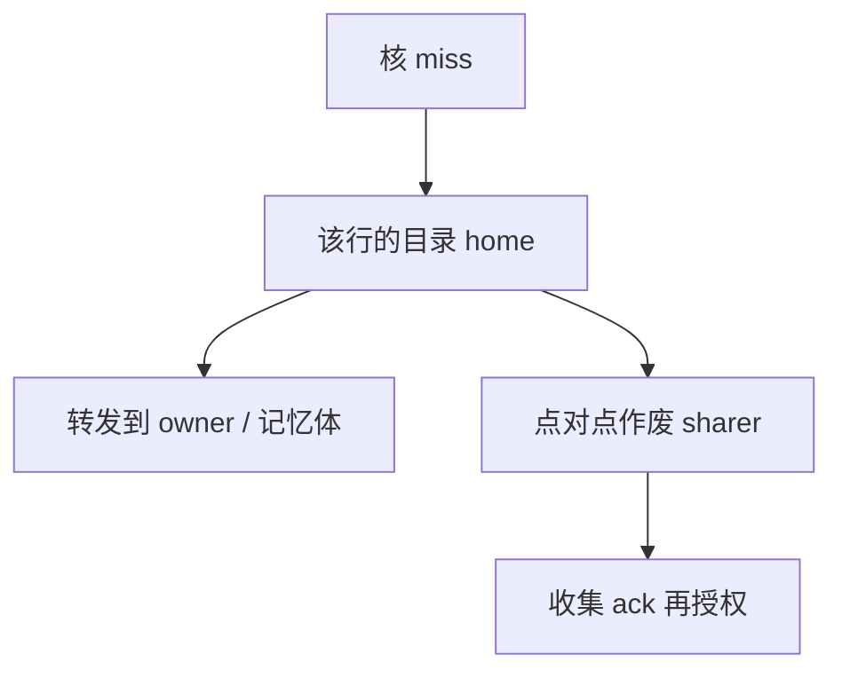

# 目录协议的扩展性

窥探要求每个缺失让所有 cache 听见；目录记下谁可能有副本，只向那几个节点发点对点请求，流量随共享集而不是随核数涨。

<footer>—— 据 Censier and Feautrier；Hennessy and Patterson, CA:AQA 整理</footer>

[上一课](/cs/moesi-mesif) 在广播总线上加了 O/F。核数到几十上百时，即使 F 减少重复数据，**地址事务仍要人人听**。本课不重画五态。缺口是**目录：每行（或每组）一份 sharer 向量 / 指针，把一致性从广播改成端到端。**

## 问题

窥探带宽 ∝ 核数 × miss 率。互连变成广播介质后，[MLP](/cs/mlp-memory-parallelism) 越高越堵。缺口不是再加一个 Forward 态，而是**用存储换广播：目录项指出可能的副本集合。** 目录本身要分区到 LLC slice 或 memory controller，否则又成为单点。

完整位向量：每核一位，精确但随核数线性涨。稀疏目录：少量指针，溢出则广播或退化为粗向量。这是面积与无效流量的交易。

## 方法

读 miss：向 home 目录要数据与权限；目录把请求者加入 sharer，若存在 owner 则转发。写 miss：目录向所有 sharer 发 invalidate，收集 ack，再给请求者 M。替换：通知目录删 sharer，脏则写回。

## 机制

延迟从「一跳广播」变成「到 home 再可能到 owner」，跳数增加，但带宽可扩展。与 [MOESI](/cs/moesi-mesif) 组合：目录里存 owner 指针而不是只存 S 集合。伪共享表现为同一目录项上的频繁 inv，协议正确、性能差。

目录存储与 LLC 标签可共存（in-cache directory）：行在 LLC 则目录免费，被踢出则要写回或记 overflow。

## 边界

本课不把某种 NoC 拓扑定成唯一 home 映射，后课 mesh 会决定 slice 怎么放。也不处理死锁的虚通道，那是 NoC 路由课。原子与 acquire/release 建立在「行已按目录拿到合适态」之上，随后几课。

后课默认：大规模用目录；共享集溢出才广播。同一行上无关变量互踢，是下一课伪共享。

## 小结

- 目录用 sharer 集合代替广播监听，换存储与多跳延迟。
- home 必须分区，否则单点。
- 行粒度上的虚假争用是下一课伪共享。
- 出处：Censier and Feautrier；Hennessy and Patterson, *CA:AQA*。
