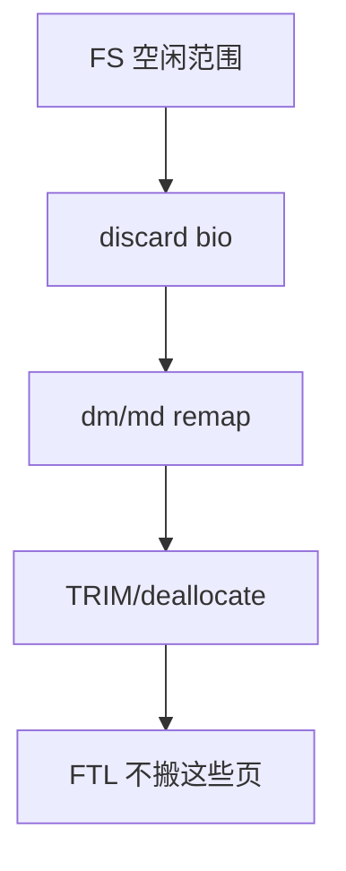

# discard 与 TRIM

discard/TRIM 告诉闪存哪些 LBA 不再包含有效数据，FTL 才好在垃圾回收时不搬它们。

<footer>—— 据 ATA TRIM / NVMe deallocate；Linux mount discard 与 fstrim 文档</footer>

[上一课](/cs/write-barrier-fua)管「必须留下的写」。删除文件、[穿孔](/cs/sparse-files)、[thin](/cs/thin-provisioning) 还块之后，SSD 若仍当有效，GC 会搬垃圾。缺口是 **discard**：FS 空闲 → 块层 TRIM → 设备 deallocate。存储栈课序在此收口。

## 问题

POSIX `unlink` 只改 FS 元数据。SSD 的 FTL 不知 inode。`FITRIM`/`fstrim` 或挂载 `discard`：对空闲范围发 discard bio。缺口：实时 discard 可能拖慢删除；批量 fstrim 更常见；安全上 TRIM 可能向下层泄露空闲图（[dm-crypt](/cs/dm-crypt) 有 `allow_discards` 旋钮）；RAID/thin 必须把 discard 正确 remap，否则剪错盘。本课不把 zoned 复位当 TRIM 的同义词，只点相近。

NVMe Dataset Management / deallocate、SCSI UNMAP 是同一意图的命令。不支持则 FS 仍能工作，只是写放大变差。

## 方法

e2fsck 不管 TRIM。运行时：`fstrim /` 查询 FS 空闲 extent，发 discard。thin：discard 取消映射并可能对池成员再 TRIM。对照 [fsck](/cs/fsck)：fsck 重建位图后应再 trim，以免位图与 FTL 长期偏离。对照预读：discard 不是读。

## 机制

TRIM 把 FS 空闲信息推到 FTL，是闪存上「诚实的空闲」。它不保证立刻擦除（安全擦除是另一命令），也不替代加密。不要写成硬件寿命营销。与配额：discard 后用量下降，记账要跟穿孔一样减。

网络下一单元：这些块 I/O 直觉有一部分会在网卡队列上重现——但对象换成包。

实现上：实时 discard 把删除变成同步设备命令，USB 桥接上会卡。fstrim.timer 批量做是发行版默认。加密盘默认不传 discard，以免泄露空闲图。 读法上只引用[上一课](/cs/write-barrier-fua)的结论，不把对象换成训练推理或限价簿。

本课在操作系统进阶的「存储栈 / 块层到设备」课序里，对象是 **discard 与 TRIM**。

- 先修只引用，不重导：上一课的结论当公理，本课只补差。
- 五栏不吞并：不把本课写成大模型训练/推理，也不写成限价簿或权重量化。
- 文献用 OSTEP、McKusick、内核文档与具名会议论文；不发明 arXiv 编号。

## 边界

本课不引入每次厂商的 TRIM 队列深度quirk。不保证 USB 桥接转发 UNMAP。文件系统与存储栈到此接到设备介质。下一单元从套接字缓冲的内核对象开始：sk_buff。

版本字段会变，课序钉的是机制对象「discard 与 TRIM」，不是某一主线内核的结构体名。
后课默认：空闲块可通知闪存。包在内核里的载体，下一课 sk_buff。

## 小结

- discard/TRIM 把 FS 空闲告诉 FTL，降低写放大。
- 批量 fstrim 往往优于实时 discard；加密与 RAID 要小心传递。
- 网络栈从 sk_buff 起。
- 出处：ATA TRIM；NVMe；Linux fstrim；*OSTEP* SSD 章。
