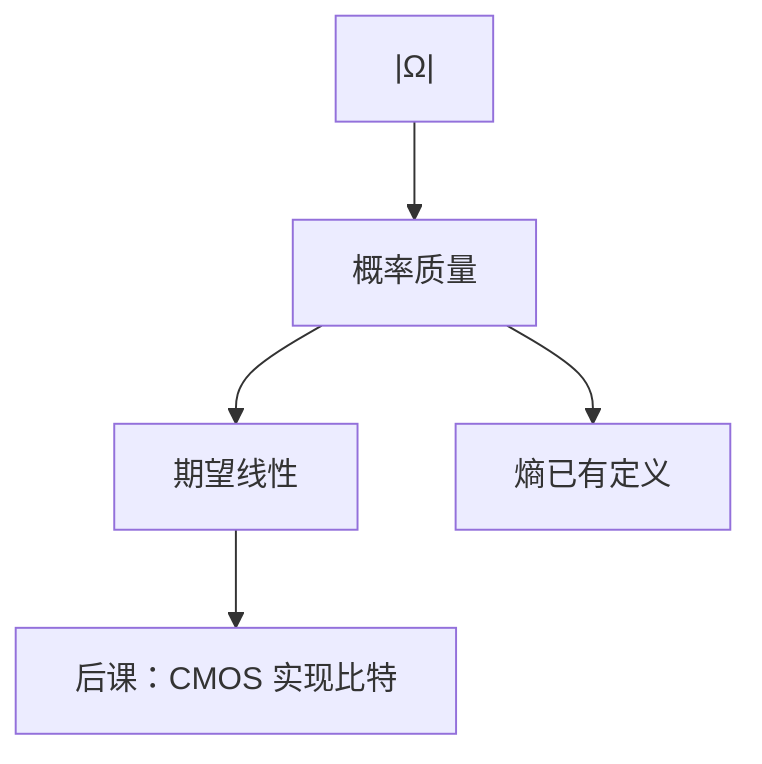
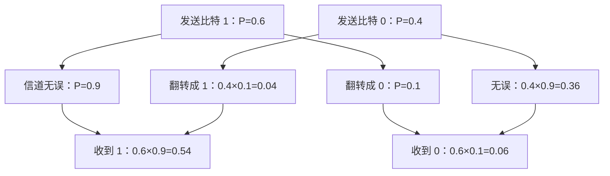

# 离散概率够用的那一层

有限样本空间上，概率是点的权重之和为 1；期望是线性的，不必先谈密度。

<footer>—— 据 Rosen, Discrete Mathematics and Its Applications；Shannon, 1948 整理</footer>

上一课[组合计数](/cs/counting-combinatorics)钉死了 $|\Omega|$ 怎么来。本课不重讲 $\binom{n}{k}$，也不从测度论另起。[熵](/cs/entropy-bits)已经用过 $p(x)$，当时声明公理后补。缺口是：把有限空间上的 $p$、事件、条件、期望写清，使熵、后课随机算法、误码率有同一套语言。信息与离散的主干到此还剩期望线性与条件贝叶斯两课。

## 问题

计数给均匀：$P(A)=|A|/|\Omega|$。非均匀时每个原子有 $p_\omega\ge 0$、$\sum p_\omega=1$。缺口因此不是再数一遍，而是事件代数（这里有限，就是幂集）、条件概率 $P(A|B)=P(A\cap B)/P(B)$、独立、期望线性 $\mathbb{E}[X+Y]=\mathbb{E}[X]+\mathbb{E}[Y]$（无需独立）。

熵 $H(X)=-\sum p\log p$ 现在是本课期望的实例。误码、后课 DRAM 刷新失败，都先建成有限或可数支撑的 $p$，不把高斯密度请进来。

### 独立不是「没有关系」的散文

$P(A\cap B)=P(A)P(B)$。不独立的典型：同一比特上的两个事件。后课哈希「独立散列」是更强的设计假设，本课只钉定义。也不把期望当成「最可能的值」：期望可以不是支撑上的点。

Rosen 的离散概率章与本课同层。Shannon 的 $p$ 现在有分母。连续概率、大数定律的证明不进主干；后课需要时用直觉「样本均值靠近期望」。

数字实例看「期望线性无需独立」：掷两个骰子，点数和的期望 $\mathbb{E}[X+Y]=3.5+3.5=7$。两个骰子当然独立，但你把其中一枚换成「必然与另一枚同点」的作弊骰，答案仍是 $3.5+3.5=7$——线性只对求和分配，从不问两个变量怎么耦合。

## 方法

$\Omega$ 有限。随机变量是函数 $X:\Omega\to\mathbb{R}$（后课常取有限值）。线性、全期望、贝叶斯在有限和里就是改求和次序。伯努利、二项来自独立重复抛币，对应比特翻转模型：后课 ECC 的「至多 $t$ 位错」是事件，概率用二项或并界估计。

```mermaid
flowchart TD
  CNT["|Ω|"] --> P["概率质量"]
  P --> EXP["期望线性"]
  P --> ENT["熵已有定义"]
  EXP --> LATER["后课：CMOS 实现比特"]
```

## 机制

有了这层，误码率、哈希碰撞概率、快排期望比较次数才有对象。本课不把那些算法写完。组合逻辑险象是确定的，不是概率；器件噪声才是概率，[CMOS](/cs/cmos-inverter)也不把热噪声量化，只实现判决。

条件独立在贝叶斯网上是后话；本课够用全概率公式切分。

```mermaid
flowchart TD
  X["发送比特 1：P=0.6"] --> OK["信道无误：P=0.9"]
  X --> FL["翻转成 0：P=0.1"]
  OK --> R1["收到 1：0.6×0.9=0.54"]
  FL --> R0["收到 0：0.6×0.1=0.06"]
  Y["发送比特 0：P=0.4"] --> OK2["无误：0.4×0.9=0.36"]
  Y --> FL2["翻转成 1：0.4×0.1=0.04"]
  FL2 --> R1
  OK2 --> R0
```

这张图回答「收到 1 时发送的是 1 的概率怎么算」：沿树把两条通往「收到 1」的路径概率相加得 $0.54+0.04=0.58$，再除以 $P(\text{收到 1})=0.58$，得 $0.54/0.58\approx 0.93$。这就是贝叶斯的全部算术：先按原因分叉，再按证据收口。

直觉类比：条件概率就是「删世界」。$P(A\mid B)$ 的分母 $P(B)$ 把所有 $B$ 没发生的世界整个划掉，分子只留下 $B$ 和 $A$ 同时发生的那些，再看 $A$ 占剩下世界的多大比例——不是 $A$ 变了，是你在数一个更小的宇宙。

直觉类比：把 $-\log p$ 想成「惊讶度」——必然事件（$p=1$）发生毫不惊讶，记 0；万分之一的事发生，惊讶度约 13.3 比特。熵 $H(X)=-\sum p\log p$ 就是按概率加权的平均惊讶度，也就是这篇课所说的「熵是 $-\log p$ 的期望」。

## 边界

本课不引入 $\sigma$-代数、勒贝格积分、随机过程。也不把金融栏的测度换元请进来。大模型栏的 token 分布是另一张表，本栏不重写。

后课默认：有限随机对象用质量函数；期望可拆开。均匀时回到计数比。下一课把期望的线性性钉成计算工具，条件反转再下一课。

## 小结

- 有限 $\Omega$ 上概率是归一化权重；均匀则回到 $|A|/|\Omega|$。
- 期望线性不需独立；熵是 $-\log p$ 的期望。
- 连续分布不进本栏主干。数字逻辑课在概率与数值各课之后才开始。
- 出处：Rosen；Shannon, 1948。
