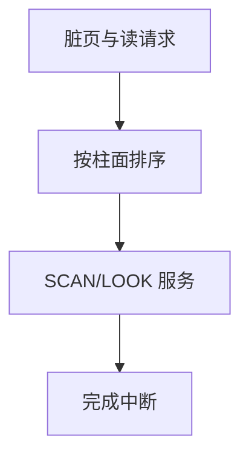

# 磁盘调度

旋转磁盘上，请求顺序决定寻道时间；电梯算法让磁头单向扫过，避免饥饿与来回抖动。

<footer>—— 据 Silberschatz et al., Operating System Concepts；Teorey and Pinkerton, A comparative analysis of disk scheduling policies, 1972 整理</footer>

[上一课](/cs/setuid-sticky)产生一串读盘与回写请求。若按到达序（FCFS）送给磁头，短寻道与长寻道混排，平均等待差。缺口是**磁盘调度**：在可旋转介质上对块请求排序。本课以寻道为主，闪存只作边界对照。

## 问题

机械盘的时间在寻道与旋转，不在总线。[调度指标](/cs/scheduling-metrics)换成：平均寻道、公平（内磁道不要饿死）。SSTF 总选最近请求，易饿外圈。SCAN/LOOK（电梯）扫到头再反向；C-SCAN 只单向服务，回来不服务，公平些。缺口不是 inode，而是请求队列上的排序。

本课不把 NCQ 与盘片内部重排的固件当主干实现。

闪存没有寻道，调度目标变成擦除块、磨损与并行通道。教学仍用机械电梯讲「请求顺序是资源」。SSD 上盲目 SCAN 无意义。

## 方法

维护按柱面排序的待服务队列。LOOK：向当前方向走到最远请求再折返。内核把缓冲回写与用户读混在同一队列时，要避免写风暴挡住读——这是策略，不是新硬件。设备完成仍走[中断下半部](/cs/interrupt-bottom-half)，完成的请求从队列消失。

## 机制

磁盘调度是 I/O 版的电梯：与 CPU 的 CFS 不同，这里优化的是机械移动，不是虚拟时间。但它同样能制造饥饿，所以 SSTF 不是默认正确答案。与页置换一起：回写时机由脏页策略决定，**顺序**由本课决定。错误地把随机脏页立刻刷盘，会把电梯打成随机寻道。

块号与柱面的映射由驱动与盘片几何（或 LBA 后的近似）给出；教学用一维柱面足够。

## 边界

本课不引入 RAID 条带的全部调度，不把网络盘的 RTT 当寻道。也不声称 Linux CFQ/BFQ/mq-deadline 与 SCAN 同构；现代多队列是另一实现。闪存与持久内存把「电梯」从主干里降为历史对照。

旋转延迟与传输时间在教学模型里常并入「服务时间」；电梯主要打寻道这一项。

闪存翻译层自己会重排，主机调度器看到的 LBA 顺序不等于芯片顺序。

后课默认：块请求可以排序后发给设备。多种文件系统如何共用同一套 `read` 路径，下一课虚拟文件系统。

## 小结

- 机械盘上顺序就是性能；LOOK/C-SCAN 权衡平均与饥饿。
- 闪存目标不同，不要把 SCAN 当普适。
- 统一文件接口是 VFS 的缺口。
- 出处：Teorey and Pinkerton, 1972；Silberschatz et al., *OSC*；Tanenbaum *MOS*。
