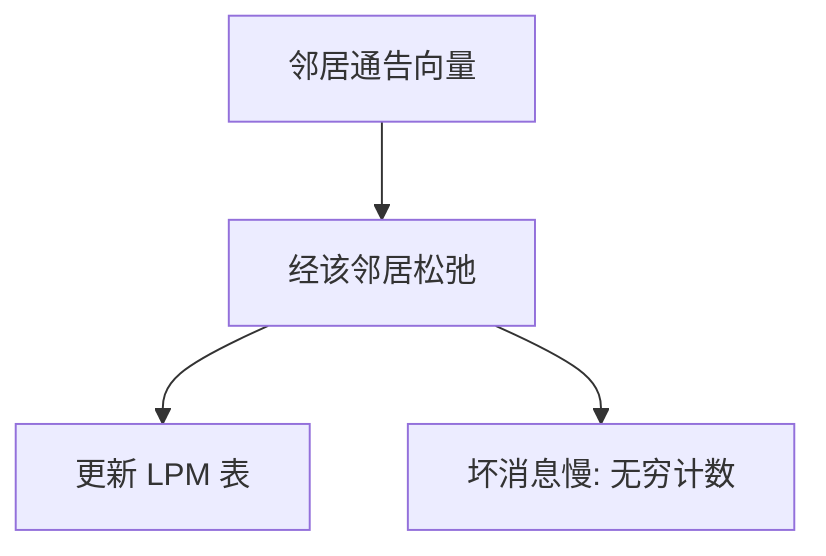

# 距离向量

每个路由器只告诉邻居：我到各前缀的距离；邻居取最小，像分布式的松弛。

<footer>—— 据 Ford, Fulkerson 与 Bellman 的最短路松弛；RFC 2453 RIP Version 2 整理</footer>

[上一课](/cs/ipv6-ndp)假定转发表已在。[LPM](/cs/lpm) 只查找不填表。缺口是控制平面的一种：邻居交换「到某前缀多远」，本地做松弛。图课的 [Bellman-Ford](/cs/bellman-ford) 已给出边权松弛；本课把它放到路由器上，并点出无穷计数。

## 问题

静态配下一跳不能跟故障。距离向量：周期性或触发地，把向量 $(前缀, 距离)$ 发给邻居。收到后，经该邻居的距离 = 通告距离 + 链路代价，比现有更好则更新。缺口不是 ICMP，而是这套分布式 BF。RIP 把无穷定为 16，跳数当代价，只适合小域。

本课不把 RIP 认证头写完。

无穷计数：链路断了，A 与 B 互相以为对方仍通，距离加到无穷。毒性逆转、水平分割是补丁，不是证明消失。

## 方法

初始化：直连前缀距离 0。通告整个向量（或增量）。失效：超时未刷新则置无穷并通告。与[生成树](/cs/spanning-tree)不同：DV 在三层，键是 IP 前缀，允许任意拓扑上的多路径候选，转发仍只装一条或 ECMP。

## 机制

DV 实现简单，内存只存向量，符合早期线路贵的环境。坏消息慢，是因为没有全局拓扑：断边之后仍可能引用彼此的旧好消息。端到端：路由震荡期间 IP 仍尽力转发，可能环到 TTL 尽，于是 [ICMP 超时](/cs/icmp)出现。传输层看见丢包。

与进程调度无关：这是路由器进程（或内核协议）之间的消息，可用后课 UDP（RIP 正是如此）。

## 边界

本课不把 EIGRP 的 DUAL 写完，不引入路径向量——那是 BGP 用 AS 路径防环。也不把负权当互联网代价：链路代价为正。全局拓扑与更快收敛是下一课链路状态。

度量若用带宽或延迟，必须保证正且无震荡；RIP 用跳数正是为了简单。触发更新比定期全表更快送出坏消息。

不等间隔的定时器抖动，用来避免同步通告造成的周期性拥塞。

后课默认：邻居向量可填表，但环与慢收敛是代价。通告整图、本地跑最短路，下一课链路状态。

## 小结

- 距离向量是分布式 Bellman-Ford，填 LPM。
- 无穷计数；水平分割只是缓解。
- 链路状态用整图对照，下一课。
- 出处：Bellman-Ford；RFC 2453；Kurose and Ross。
