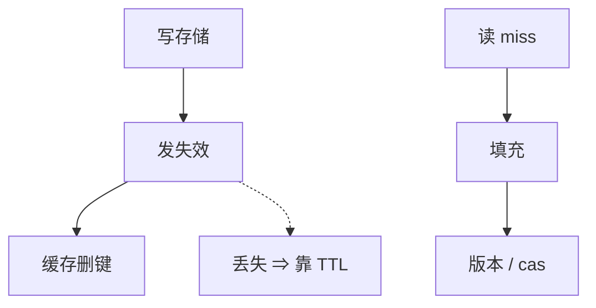

# 分布式缓存失效

写库后通知缓存删键。通知丢失或乱序，缓存就永远脏。失效是尽力而为的提示，TTL 与版本才是保险。

<footer>—— 据 Gray and Cheriton 租约缓存；Nishtala et al., Scaling Memcache at Facebook, NSDI 2013 整理</footer>

上一课[发布订阅](/cs/pub-sub)常被拿来发「这个键脏了」。缺口是**失效消息不是线性一致读路径**：丢一条就脏到 TTL。本课钉失效与租约/TTL 的组合，不重写 Merkle 反熵。后课雪崩是失效或过期对齐时的读打穿。

## 问题

旁路缓存：读 miss 打库再填；写库再删缓存（或先删后写，各有窗口）。分布式后有多缓存节点、多写者。失效总线丢消息 ⇒ 永久脏直到 TTL。乱序：先写新值的失效晚到，把新填的缓存又删，或旧失效打掉新值后旧填充回来。

缺口：把 memcache 当线性一致层。Facebook 的 NSDI 论文描述租约防惊群、以及失效与填充的竞态，不是「缓存强一致」。

Gray–Cheriton 租约让服务器在写前等租约到期，缓存侧有期限。纯 pub-sub 失效没有这层算术。

## 方法

组合：短 TTL（最终正确）+ 尽力失效（尽快正确）+ 版本/cas（填充时核对）。写路径：更新存储的版本，填充带版本，失效带版本，旧填充不得覆盖新。租约：fill 时持短租约，防同一 miss 打穿。

不要用跨机墙钟排序失效。用存储版本或 HLC。

## 机制

先删缓存再写库：读会 miss 打到旧库，填旧，再写库，缓存旧——经典竞态。先写库再删：删丢失则脏。两种都要 TTL。多级缓存每级都要失效或更短 TTL。

与线性一致：只有读穿透到线性一致存储且不读缓存，才保持原档。缓存命中默认掉档，像[会话](/cs/session-guarantees)若粘滞同一缓存节点可 RYW，换节点则否。

本课不写 CDN 的 PURGE 协议全文。也不写 CPU 缓存 MESI——那是体系结构课。

## 边界

本课不把 Redis 键空间通知当完备失效。后课默认：缓存是性能层，正确性锚在存储版本与 TTL；失效总线提高新鲜度。下一课处理同时 miss 与热键把存储打穿。

失效是提示。提示丢失必须有上限脏时间。

## 小结

- 失效丢失 ⇒ 脏到 TTL；乱序要用版本。
- 先删后写与先写后删都有竞态窗口。
- 租约/cas 约束填充，不把缓存升级成 RSM。
- 出处：Gray and Cheriton, SOSP 1989；Nishtala et al., NSDI 2013。
