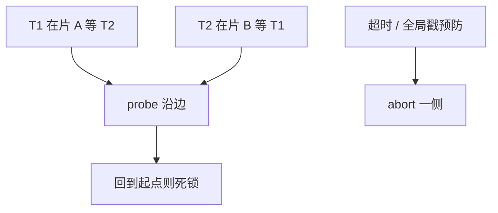

# 分布式死锁

等待边跨节点时，局部无环仍可能全局有环。检测靠探测或超时，预防靠全局戳与锁序。

<footer>—— 据 Obermarck 探测算法；Gray and Reuter；单机 wait-for 课的网络扩展</footer>

[上一课](/cs/spanner-truetime)跨 Paxos 组 2PC。本课不 commit wait。缺口是锁等待图跨机器：片 A 上 T1 等 T2，片 B 上 T2 等 T1，各节点 DFS 看不见环。主干单库 WFG。进阶：边追逐（probe）、中心检测器、或超时。Calvin 定序加锁按键序可避免环。

## 问题

探测：等待者发 probe 沿等待边走，带着事务 id 路径，回到自己则环。虚假探测、探测风暴是代价。中心：各节点汇报边，中心求环——单点与延迟。超时：假阳性。缺口是**与 2PC 嵌套**：prepared 等协调器，协调器等锁，图更怪，要包含协议边。

wait-die 用全局时间戳预防，跨节点仍成立若戳全局。伤口等待同理。

Obermarck 分布式死锁检测。Gray and Reuter。本课不实现完整 probe 包格式。

## 方法

工程常超时+死锁日志，精确检测留给锁量小的系统。Spanner 类：锁在组长，跨组 2PC 超时。Percolator：锁在行上，客户端轮询超时清理。

锁序：对分片 id 排序加锁，预防环，可能增加延迟（多一轮）。

## 机制

牺牲者回滚要跨片 undo，2PC abort。检测延迟加大锁持有，放大死锁概率——恶性循环，故预防或短超时常见。

与 MVCC：无锁等待则无这类环，abort 来自冲突。混合系统两套。

## 边界

本课不讲一致性哈希环。也不把死锁当拜占庭。网络分区造成的「永远等」是故障检测器，不是环。

后课默认：跨片锁要超时或探测或全局序。一致性哈希在数据库：环上放片，减再平衡搬家。

分布式 WFG 的边是 RPC，延迟让检测本身过期。

## 小结

- 全局环需探测、中心图或超时；预防用全局戳或锁序。
- 2PC prepared 状态必须进等待模型。
- 一致性哈希在数据库下一课。
- 出处：Obermarck；Gray and Reuter；wait-die。
