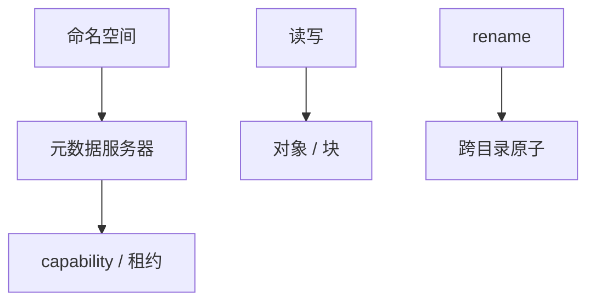

# 分布式文件与元数据

字节好分片，目录与 inode 难：一次 `rename` 要原子改两个目录。元数据服务的 QPS 与一致性往往先于数据面成为瓶颈。

<footer>—— 据 GFS NameNode 经验；Weil et al., Ceph, OSDI 2006；POSIX rename 语义对照整理</footer>

上一课[对象存储](/cs/object-storage-s3)用扁平键避开目录原子。缺口是**仍要文件系统 API** 时：权限、目录、硬链接、rename。本课钉元数据面，不重写块流水线。后课 Borg 用到卷与隔离，不在本课。

## 问题

HDFS NameNode 把树放内存，文件数墙。Ceph：动态子树或哈希到 MDS 集群，客户端缓存能力（capability），收回像[租约](/cs/leases)。rename 跨 MDS 要分布式协议，类似短 2PC 或日志。缺口：数据三副本很便宜，元数据一次跨目录操作很贵。

POSIX：同一文件系统 rename 原子。分布式若只改一侧目录，崩溃则丢项或双项。这是[共识与 2PC](/cs/consensus-vs-2pc)在 inode 上的投影。

Weil 的 Ceph 用 CRUSH 算数据位置，元数据另做 MDS。GFS 刻意弱 POSIX 就是为了躲这面墙。

## 方法

分片键：按目录哈希则 rename 跨片；按子树则热目录热点。缓存：dentry 缓存必须能收回，否则权限撤销不可达。小文件：数据内联进元数据，避免每文件三副本开销。

不要让客户端只信本地 dentry 而不管收回。

## 机制

与线性一致：打开文件后的读是否看到最新写，POSIX 与 NFS close-to-open 不同档。NFS 课已有语义，本课只提醒分布式集群同样要声明。与对象：没有 rename 原子时，应用用「写临时键 + 条件换键」模拟，失败窗口自己管。

本课不写 POSIX 每一条。也不写光电刻蚀。

热父目录（所有人 mkdir 同一文件夹）是元数据热键，接[热键](/cs/cache-stampede-hotkey)。

## 边界

本课不把 Lustre 全部协议写完。后课默认：选对象还是选文件系统，先问是否要跨目录原子与 POSIX。Borg/k8s 下一课消费这两种存储当卷。Tail at Scale 再谈元数据 RPC 的尾延迟。

数据面扩展不等于 API 扩展。目录是共享可变对象。

## 小结

- 元数据 rename/mkdir 是分布式原子问题。
- NameNode 单树内存是墙；MDS 分片有热目录与跨片税。
- capability 收回同租约；客户端缓存必须能失效。
- 出处：GFS；Weil et al., OSDI 2006。
