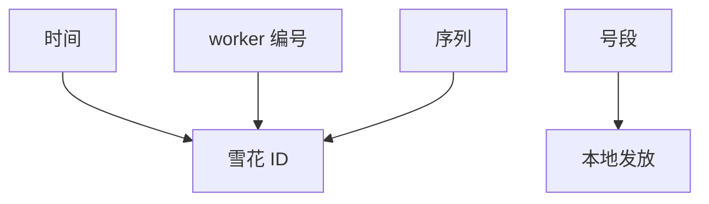
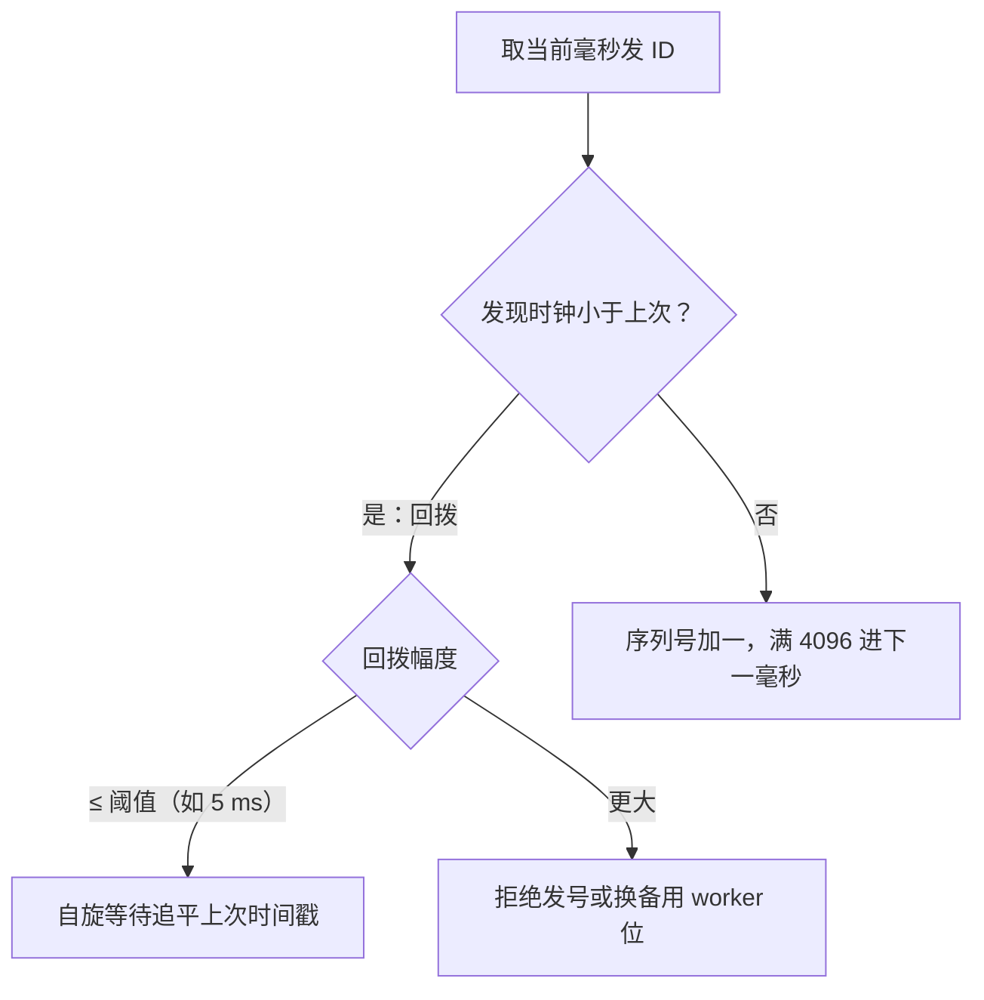

# 分布式 ID

唯一标识不必来自中心自增。雪花一类：时间 + 机器 + 序列。有序、可追溯、无单点；代价是时钟与机器编号的规格。

<footer>—— 据 Twitter Snowflake 公开设计；UUID 标准；Lamport 时间戳对照整理</footer>

上一课[Tail at Scale](/cs/tail-at-scale)警告中心热点。缺口是**生成主键**：数据库 `AUTO_INCREMENT` 是单点尾延迟与故障点。本课钉 ID 方案与时钟依赖。后课地理复制会让「时间序」更假。

## 问题

要求组合：全局唯一、大致时间可排序、高 QPS、故障隔离。UUID v4：唯一性好，无序，索引随机写碎。UUID v1：含时间与 MAC，隐私与时钟。Snowflake：毫秒时间戳、worker id、序列。worker id 来自配置或 ZK/etcd 租约——又把小 CP 请回来，但只在启动。

缺口：时钟回拨使时间戳段重用，破唯一。要等或用[HLC](/cs/hlc)或拒绝。多机房 worker id 空间要划片，否则碰撞。

Snowflake 是工程博客级源头，不是 TODS。数据库号段（一次取一千）是折中：中心少热点，ID 仍大致单调。

数字实例看经典 64 位雪花布局：41 位毫秒时间戳约够用 $2^{41}\text{ ms}\approx 69$ 年；10 位 worker 编号容纳 1024 台机器；12 位序列号表示同一毫秒内单机可发 $4096$ 个。合计单机峰值约 $4096\times1000\approx 409$ 万 ID/秒——唯一性压在「时间别回拨、worker 别撞号」这两条规格上。

## 方法

选：无序唯一用随机；要局部单调用雪花或号段。号段：每个应用实例从 RSM 拿一段，本地发完再拿——段边界可有洞（实例崩）。洞通常可接受，连续当规格则必须中心。

```mermaid
flowchart TD
  CLK["时间"] --> SF["雪花 ID"]
  WID["worker 编号"] --> SF
  SEQ["序列"] --> SF
  RSM["号段"] --> LOCAL["本地发放"]
```

不要用墙钟毫秒当唯一：同毫秒多机碰撞。

## 机制

与线性一致计数器：中心 `INCR` 唯一且单调，QPS 受单日志限制，尾差。雪花把唯一性拆到时间维，单调只在同一 worker 且时钟不回拨。跨 worker 比较大小 ≈ 比较时间，受 $\varepsilon$ 限制——不能当因果。

本课不写区块链 nonce 挖矿。也不写证件号合规。

热行：以 ID 为分区键且 ID 时间单调，则写总打最新分区（Mongo 等经典坑）。要哈希，或在高位加 shard 随机。这是热键在主键上的投影。

```mermaid
flowchart TD
  NOW["取当前毫秒发 ID"] --> Q{"发现时钟小于上次？"}
  Q -->|"是：回拨"| SMALL{"回拨幅度"}
  SMALL -->|"≤ 阈值（如 5 ms）"| WAIT["自旋等待追平上次时间戳"]
  SMALL -->|"更大"| REFUSE["拒绝发号或换备用 worker 位"]
  Q -->|"否"| SEQ["序列号加一，满 4096 进下一毫秒"]
```

这张图回答「时钟回拨时发号器该怎么办」：回拨意味着同一毫秒可能被用第二次，时间戳段重用就会撞 ID。工程上分档处理——小回拨（NTP 微调几十毫秒内）就地等表追上来；大回拨（换电池、手动改时间）只能拒绝服务或动用预留的 worker 位。这就是「雪花要声明回拨策略」的具体含义。

直觉类比：墙钟像一块会被别人拨动的挂钟——NTP 校时、人工改表、闰秒都可能让它倒着走。发号器要的是「只进不退的秒表」：所以要么在内存里记住自己发过的最大时间戳（发现倒退就等或拒），要么换 HLC 这类逻辑钟兜底。

常见误区：初学者觉得 UUID v4「随便生成不会撞，当主键最省事」。随机 ID 落进 B+ 树的位置也随机：每次插入都可能命中任意一页，页频繁分裂、缓存命中差、写放大明显。同样的行数，用趋势递增的 ID 顺序追加写索引页，吞吐可以差出数倍——「唯一」与「对索引友好」是两个要分开买的属性。

## 边界

本课不规定 64 位布局。后课默认：规模 ID 不用单点自增；雪花要声明回拨策略与 worker 分配。地理复制下一课让「谁的毫秒」更乱，跨区 ID 更要划 worker 空间。滚动升级时 worker 重编号不得碰撞。

唯一是安全；有序是性能与产品。两件事分开买。

## 小结

- 中心自增唯一但成尾与单点。
- 雪花：时间+机器+序列；回拨与 worker 分配是规格。
- 单调 ID 当分区键会写热分区。
- 出处：Snowflake 设计；UUID；对照 Lamport 钟。
