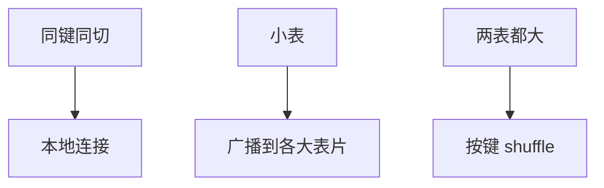

# shuffle 与 broadcast join

等值连接在分片上要让同键碰面：shuffle 按键重分区，broadcast 把小侧复制到每一片。网络字节是代价模型的新项。

<footer>—— 据 Graefe exchange；DeWitt 并行连接；分布式 Grace 同构</footer>

[上一课](/cs/shard-key-rebalance)把行放在片上。本课不选用户 id。缺口是连接：若两表已按连接键同切（collocated），工人本地连，无网络。否则要 [exchange](/cs/parallel-exchange) 的网络版：shuffle join 或 broadcast join。单机 Grace 的分区文件换成网络块。

## 问题

大对大：两边按连接键 hash 送到 $N$ 个工人，正确性同 Grace。小对大：广播小表，大表本地扫，避免动大表。缺口是估计：小表估错会变成广播一张大表打爆内存——基数误差的分布式形态。倾斜：单键打到一工人，同单机倾斜。

半连接归约：先传键再拉匹配行，Bernstein-Chiu 思想，减 payload。延迟物化：只 shuffle 键+位置，载荷留在存储节点——存算分离后课。

并行数据库教科书连接。Spark shuffle 是同一算子在批处理引擎。本课数据库执行器。

## 方法

优化器比较：colocated < broadcast < shuffle（通常）。强制提示可钉。bloom 过滤器随广播或 shuffle 前过滤。外连接：broadcast 方向受限（只能广播被保留侧的对面等），与外连接下推防火墙同类。

## 机制

RTO 无关；这是查询时流量。计划回归：统计变化让昨日 colocated 今日 shuffle。网络校准必须进代价模型，否则 DP 以为哈希内存连接免费。bloom 随广播或 shuffle 前过滤，减 payload，思想同 LSM 布隆但走的是连接键。

事务：分布式连接一般读快照，写仍按分片事务。连接本身不提交两片写。外连接限制 broadcast 方向。倾斜使某一工人收到大部分键，并行名存实亡——要拆热键或加盐，与单机 Grace 相同病。

## 边界

本课不讲 Percolator 锁。也不把 MapReduce shuffle 当 SQL 连接的定义——后课 MR 是另一套。图遍历的多跳 shuffle 更重，图库课。

后课默认：跨片等值连接靠 colocated / broadcast / shuffle 三选。Percolator：在 Bigtable 上用锁表做跨行事务。

网络是第二磁盘。估错大小等于估错 I/O。

## 小结

- 同切本地连；否则广播小表或按键 shuffle。
- 倾斜与估错会打爆单工人。
- Percolator 下一课：宽列上的分布式事务。
- 出处：Graefe；DeWitt；Bernstein-Chiu 半连接。
