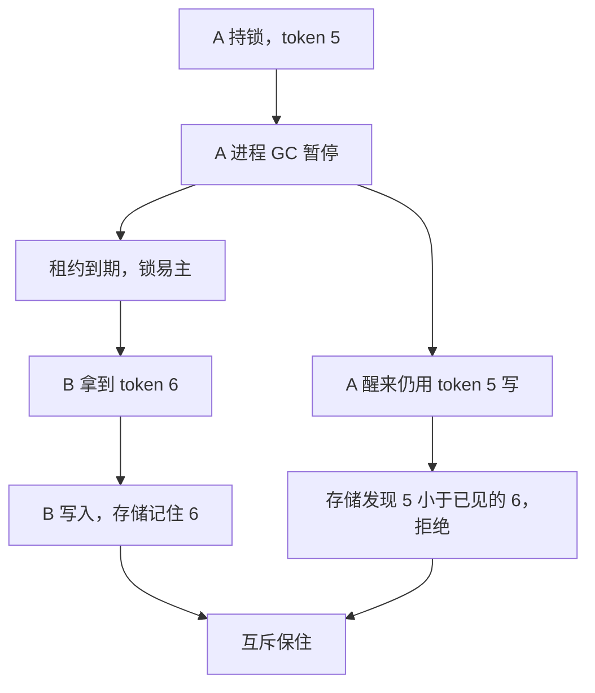

# 分布式锁与 fencing

锁服务说「你持有」不够。持有者暂停后仍会写。必须把单调 fencing token 打进每一笔副作用，资源拒绝旧代。

<footer>—— 据 Burrows, The Chubby Lock Service, OSDI 2006；Gray and Cheriton 租约；Ongaro 对 fencing 的讨论整理</footer>

上一课[脑裂](/cs/leader-election-split-brain)说至多一个有效主。缺口是**锁的客户端会停很久再醒来**：锁已过期发给别人，醒来的进程仍写共享存储。本课钉 fencing，不重写多数派选举。后课 Chubby/etcd 是把锁做成服务的例子。

## 问题

错误模式：进程 A 得锁，GC 暂停，锁租约到期，B 得锁并写，A 醒来用旧连接写——后写覆盖。锁服务此时认为 A 已不是持有者，但存储不知道。缺口不是更短超时，而是**资源验证代次**。

常见误区：以为锁服务会在租约到期时「广播」通知存储和 B「A 已失效」。实际上锁服务只管发 token，之后的每一次写它都不参与——「A 已过期」这个事实必须由资源自己在比对 token 时发现，缺了这一步，通知就永远缺位。

Fencing token：锁每次授予单调递增整数。A 的 token=5，B 的 token=6。存储（或对象版本、或 HDFS 租约）拒绝 $\lt $ 当前最大 token 的写。A 的迟到写失败。这把[租约](/cs/leases)从「时间」换成「资源上的代次」。

没有存储配合，任何「分布式锁」都只是提示，不是互斥。ZooKeeper 食谱若只创节点不带 fencing，有经典坑。

## 方法

协议：acquire → 拿到 token → 所有写带 token。校验在资源侧，不在锁客户端侧。锁服务自己必须线性一致（RSM），否则两个 token 的「更大」没定义。

术语翻译：「线性一致」是说锁服务内部对每次授予都记在一条全体公认的先后账本上——任何客户端在任何时刻问「当前最大 token 是几」，答案都相同。若它只是普通主从复制，脑裂时两个副本可能各发一个 6，代次比较立刻失效。

与互斥算法（Lamport bakery 等）：那些假定进程按协议走、不暂停后乱写外部。数据中心进程对外部有副作用，必须 fencing。

## 机制

etcd/ZK：用修订号、ZXID 当 token。Chubby：sequencer。对象存储：条件写 `If-Match` 版本。数据库：乐观版本列。缺条件写的 NFS 文件很难 fencing——不要用它当锁资源。

数字实例：条件写就像存储只认「暗号对上才执行」。你发 `If-Match: "v5"`，若服务器当前版本已是 v6，这次 PUT 整个被拒、返回 412，一个字节都不会写进去。先读版本、再带版本写，就是手工版的 fencing。

锁不是事务：持有期间崩溃，要靠租约到期。锁不是共识日志：它只互斥临界区，临界区里的状态复制仍要自己做。把「先拿锁再写两台数据库」当分布式事务，会在暂停窗口丢互斥——必须 token 进两库或改用 2PC/共识。

本课不把 Redis `SET NX` 当完整锁服务：默认无 fencing、过期与 GC 同构。

## 边界

本课不写死锁检测图。不引入红锁的全部争论（点名：多独立 Redis 仍缺共享 fencing 资源则论证弱）。后课默认：锁 = 线性一致授予 + 资源侧 token。etcd/Chubby 下一课看服务形态。PoW 不是锁。

时间到期只回收锁。Token 才回收副作用权。

## 小结

- 租约到期后旧持有者仍可能写；要 fencing token。
- Token 必须由资源校验，锁客户端自报无效。
- 锁服务本身要线性一致，否则代次无全序。
- 出处：Burrows, OSDI 2006；租约文献。
