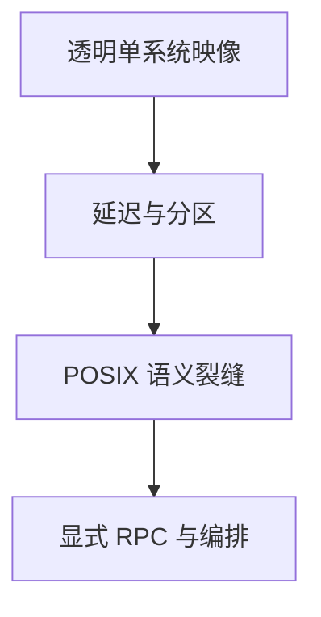

# 分布式 OS 直觉

分布式操作系统试图让多机共享同一套进程与文件抽象；网络分区与延迟使「单机 POSIX」无法透明延伸，于是实践退回显式 RPC、集群与容器编排。

<footer>—— 据 Tanenbaum and Van Steen, <em>Distributed Systems</em>；[NFS 语义](/cs/nfs-semantics) 为已见裂缝</footer>

[NT 对照](/cs/windows-nt-contrast) 仍是单机。[NFS](/cs/nfs-semantics) 已削弱 POSIX。[热迁移](/cs/live-migration) 搬的是整台 VM。缺口是 **为何没有透明分布式 Unix**：直觉封口操作系统进阶。

## 问题

Amoeba、Sprite、Plan 9 曾把资源当网络上的名字。缺口：CAP 式权衡（本课不重开分布式课全文）——延迟、分区、身份。Linux 实践：单机内核 + 用户态编排（k8s）+ 显式 RPC。本课不发明论文编号，不写编排教程。

单系统映像 SSI 集群存在，失败模式仍是网络。对象是抽象能不能透明，不是具体中间件。

## 方法

对照 NFS close-to-open：已是不透明。对照 [netns](/cs/netns-veth)：隔离不合并多机。对照 [RDMA](/cs/rdma-os)：快路径仍要显式 verbs。对照 seL4：证明停在单核/单机假设。

## 机制

OS 进阶课把单机栈从 FAT 讲到微内核与 VMM；分布式「同一 OS」在网络上裂开，必须换接口。这不是失败，是边界：后课若进网络/数据库栏，从显式协议开始，不假装 `read` 跨机仍瞬时一致。不要写成量化撮合集群。与 [fsync](/cs/fsync)：持久是单设备故事；跨机要复制协议。

Plan 9 的 9P 仍有 virtio-fs 回声——显式协议，不是魔法透明。

实现上：Plan 9 的 9P 把一切当文件，但仍是显式协议，断线有错误。SSI 集群在分区时必须选脑裂策略。编排系统接受不透明，换来可推理的失败。 读法上只引用[上一课](/cs/windows-nt-contrast)的结论，不把对象换成训练推理或限价簿。

本课在操作系统进阶的「虚拟化与隔离进阶 / 容器与内核形态」课序里，对象是 **分布式 OS 直觉**。

- 先修只引用，不重导：上一课的结论当公理，本课只补差。
- 五栏不吞并：不把本课写成大模型训练/推理，也不写成限价簿或权重量化。
- 文献用 OSTEP、McKusick、内核文档与具名会议论文；不发明 arXiv 编号。

## 边界

本课不引入全部 SSI 项目。不保证未来 CXL 内存池改变边界——那仍要新一致性课。操作系统进阶到此：布局、块、包、页、调度、启动、观测、虚拟化与形态都已钉住。

版本字段会变，课序钉的是机制对象「分布式 OS 直觉」，不是某一主线内核的结构体名。
后课默认：单机 OS 抽象不透明扩展到分区网络。操作系统进阶在此封口；下一课程从[香农容量在链路](/cs/shannon-capacity-link)起计算机网络进阶。

## 小结

- 透明分布式 Unix 被延迟与分区挡住。
- 实践是单机内核加显式网络与编排。
- 操作系统进阶课序到此结束；下一课香农容量。
- 出处：Tanenbaum *Distributed Systems*；NFS；Plan 9/9P 背景。
