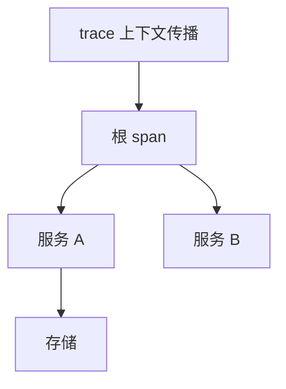

# 分布式追踪

一次请求跨许多进程，把因果边采成 span 树。采样与传播头让你看见扇出，不是代替[向量时钟](/cs/vector-clocks)的完备偏序。

<footer>—— 据 Sigelman et al., Dapper, a Large-Scale Distributed Systems Tracing Infrastructure, Google 技术报告 2010 整理</footer>

上一课[负载均衡](/cs/lb-strategies)把请求打散。缺口是**一次用户调用变成哪些 RPC**：过载与错误发生在哪一跳。本课钉 Dapper 式追踪：trace id、span、采样。后课三支柱把日志与指标接上。不重写 happened-before 定理。

## 问题

Dapper：前端生成 trace id，沿 RPC 传播；每跳一个 span，父子边是调用。采样：全量太贵，按树决策（根决定采不采）保持一棵树完整。缺口：追踪是调试与容量的观察，不是线性一致证明。时钟用墙钟画甘特，跨机可能倒序——接[时钟漂移](/cs/clock-drift)，边靠传播的父子关系，不靠 NTP。

与日志：日志无跨进程 id 则拼不出树。与指标：指标无单次请求。

2010 技术报告是工业源头。OpenTelemetry 是后来的 API 收敛，本课点名不写规范全书。

## 方法

埋点在 RPC 桩与队列消费者：取出/注入上下文。异步消息要把 trace 放进消息头，否则 Saga 步骤断链。采样率可动态，错误路径可强制采。

不要只在成功路径埋点。失败跳往往没 span，最需要看。

## 机制

Head-based 采样：根决定，便宜，可能漏稀有错误。Tail-based：先全量收再决定留哪些，贵，能留异常树。生产常混合。高基数标签（user id）会把追踪后端打成热键——接上一课序。

本课不写 Zipkin 全部 UI。也不把追踪当安全审计完整解（缺不可伪造）。

因果：span 父子 ⊂ happened-before，但未埋点的边看不见。不能用追踪图当 Chandy–Lamport 快照。

## 边界

本课不把指标仪表盘画全。后课默认：跨服务排障先跟 trace id；时钟只用来显示，边用传播。可观测三支柱下一课说明三者不可互相替代。

看见扇出才能解释 P99。看不见的边等于不存在于调试里。

## 小结

- Trace/span 树靠上下文传播，不靠 NTP 排序。
- 采样保整树；错误路径要能强制采。
- 观察工具不是一致性证明。
- 出处：Sigelman et al., Dapper, 2010。
