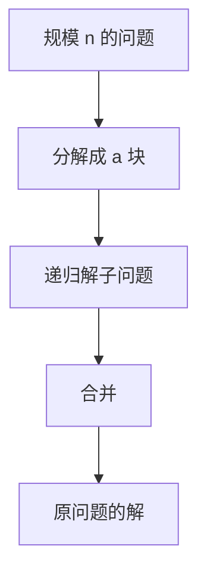

# 分治

把问题切成同类子问题，递归解完再合并；代价由切法与合并共同决定。

<footer>—— 据 Knuth, The Art of Computer Programming, vol. 3；CLRS 第 2、4 章整理</footer>

上一课[Akra–Bazzi 对照](/cs/akra-bazzi)已经能读 $T(n)=aT(n/b)+f(n)$。本课不重证三种情形。缺口是：递归式从哪来。数据结构课给了数组、树、图的表示，没有说「把规模对半切」是一种设计。本课只钉分治三步：分解、递归、合并；具体排序算法下一课才写。

## 问题

循环不变式适合**同一数组上逐步扩大前缀**。有些问题前缀扩不成：左右两半各自有解，合在一起才是原问题的解。若不会分解，就只剩 $O(n^2)$ 的双重循环。缺口不是渐近记号，而是承认子问题与原问题同型，规模严格变小，合并是显式步骤。

本课不引入动态规划。分治的子问题通常不相交或几乎不相交；重叠子问题是[后课](/cs/dynamic-programming)的缺口。这里只要求：切完能递归，合完满足原问题的后置条件。

### 分治不是「递归」的别名

递归是控制结构；分治是切问题的方式。深度优先搜索也递归，但不是按规模等分再合并答案。尾递归循环更不是分治。后课见到 `recurse(left); recurse(right); merge` 才叫本课的对象。

Knuth 把归并当作外存与内排的共同骨架。CLRS 用归并引入分治，再用主定理收阶。本课把「范式」从「某一个排序」里抽出来，避免下一课重讲切法。

## 方法

指定如何把输入分成 $a$ 块（常 $a=2$、$b=2$），对每块调用同一过程，再写合并。正确性：子问题规模小于 $n$，基准情形直接解；归纳假设子解正确，证明合并保持后置条件。代价：写出 $T(n)$，套主定理。

分解本身可以是 $\Theta(1)$（中点下标）或 $\Theta(n)$（复制到新数组）。合并可以是 $\Theta(n)$（归并）或 $\Theta(1)$（最大值在根）。主定理里的 $f$ 就是分解加合并。

## 机制

分治把空间也切开：每层可以新开缓冲，总额外空间常 $\Theta(n)$；就地切（快排分区）把额外空间压到递归栈。本课不选定哪一种，只声明空间是合并策略的一部分。后课插入是循环，归并是分治，对照才有意义。

并行直觉（两半可同时算）本课点到为止：正确性不依赖并行；只是 $a$ 个子问题在数据上不相依。

## 边界

分治不保证比循环快。切得不均衡，主定理的 $b$ 失效，最坏可以退回平方。也不自动处理图上的全局约束：最短路不是「左右两半的最短路再拼」。图算法仍走 BFS/松弛，不套本课模板。

后课默认：说到分治，就是分解–递归–合并，递归式用主定理读。插入与归并的对照是下一课的缺口。

## 小结

- 分治 = 同类子问题 + 规模下降 + 显式合并。
- 正确性走递归归纳；代价走主定理。
- 子问题重叠不是本课；图上的全局最优也不是。
- 出处：Knuth, TAOCP vol. 3；CLRS 第 2、4 章。
