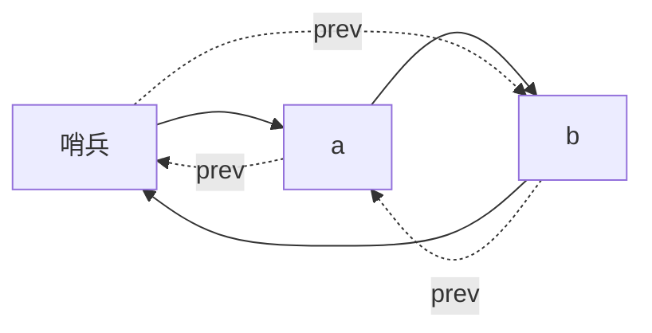

# 双向与循环链表

再加一条前驱指针，删除就不必先找上一节点；把头尾接成环，空表与单节点用同一套绕接规则。

<footer>—— 据 Knuth, The Art of Computer Programming 卷 1；Cormen, Leiserson, Rivest and Stein 整理</footer>

[上一课](/cs/linked-list-locality)以单向链表为主，点名双向用再一个指针换前驱，并强调指针追逐的局部性代价。本课不重讲「插入改两三条边」。缺口是把双向与循环写成可用的表示：已知节点删除 $\Theta(1)$、反向遍历、以及哨兵/环降低空表分支。栈课立刻要用「序列的两种表示」；本课把链表这一侧收齐。

## 问题

单向删除若只知道被删节点，找不到前驱，必须从头扫，合同退化成 $\Theta(n)$。操作系统与内核队列经常「从任意节点摘下」。缺口不是新的 ADT，而是节点 `{prev, next, 值}` 的不变式：`x.next.prev = x`（在非空双向表上）。循环：最后一个 `next` 指向头（或哨兵），避免 `tail.next` 为空的特殊情况。

局部性不会因此变好：多一个指针，节点更大，cache 行装更少。本课承认这笔常数，不把链表改回数组。

哨兵节点让空表也有一个真实对象，插入删除少写 `if head==null`。循环哨兵是 Knuth 卷 1 的常用手法。

## 方法

双向插入在已知 `p` 前或后：改四条边。删除 `x`：`x.prev.next = x.next`，`x.next.prev = x.prev`。循环：用哨兵 $s$，$s.next$ 为真头，$s.prev$ 为真尾；空表 $s.next=s.prev=s$。

遍历终止：走回哨兵，不要用空指针当结束（环上没有空）。

## 机制

合同仍是序列，端点操作与中间操作都可 $\Theta(1)$ 步（位置已知）。按下标仍 $\Theta(i)$。与动态数组分工不变：要随机访问用数组；要任意位置摘挂用双向链。

循环在轮转调度、约瑟夫环一类「到尾接回头」的轨迹上少一次分支。正确性靠不变式而不是靠「最后一个节点的 next 为 null」这种单向习惯。

## 边界

本课不引入 XOR 链表压缩前后指针，不写无锁 CAS 环。也不把循环双向表当成队列的唯一实现——队列课会再用数组环形。跳表的多层前向指针是另一课。

后课默认：序列的链表表示可以是双向、可循环、可带哨兵。栈把操作收到一端，数组顶或链表头均可。

## 小结

- 双向：已知节点删除 $\Theta(1)$，可反向走。
- 循环加哨兵：空与非空同一套绕接。
- 局部性仍差；栈下一课收窄到 LIFO。
- 出处：Knuth, *TAOCP* 卷 1；Cormen et al. 双向链表。
