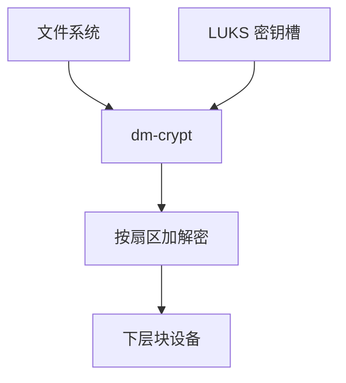

# dm-crypt

dm-crypt 作为 device mapper 目标，对每个扇区加解密：上方面向明文块设备，下面是密文盘，密钥在内核密钥环。

<footer>—— 据 Linux dm-crypt / cryptsetup 文档；Fruhwirth 对 LUKS 盘格式的说明</footer>

[上一课](/cs/raid-levels-write-hole)的阵列仍是明文。[dm](/cs/device-mapper-lvm) 的表可以插入 crypt 目标。缺口是 **块层加密**：XTS 等模式、LUKS 头、与 FS 校验的分工——不是 TLS，不是量化栏。

## 问题

丢盘等于泄露文件。FS 加密（fscrypt）按文件；dm-crypt 按设备，交换分区、整盘、LVM 下都能包。LUKS：口令派生密钥，槽可多用户。I/O：bio 明文进 crypt，CPU 或 AES-NI 处理后 remap 到下层。缺口：扇区 tweak 防止两处明文相同密文相同；TRIM 是否泄露空闲图（后课 discard）；对齐与 [O_DIRECT](/cs/direct-io)。

认证加密（integrity + crypt）另有 dm-integrity 叠层，抗重放与篡改，性能税更高。本课先钉保密性路径。

## 方法

`cryptsetup luksOpen`：读 LUKS 头，把密钥装进 dm 表。之后 `/dev/mapper/name` 像普通盘，可再 LVM 或直接 mkfs。对照 [xattr](/cs/xattr-acl)：文件级策略看不见整盘交换。对照 NFS：加密的是本地块，不是 RPC。CPU 占用可 cgroup，但对象仍是 bio。

## 机制

dm-crypt 把「落盘不可读」收成块层策略，FS 无需改布局。它不隐藏块号与大小模式——侧信道仍在。与 [COW 校验](/cs/fs-checksum-scrub)：校验宜在明文侧（FS）或另做认证层；只加密不认证会被替换扇区。不要把本课写成密码学课程重开。

启动：initramfs 里解锁根盘，后课 pivot 再遇。

实现上：XTS 的 tweak 通常是扇区号，克隆盘若扇区号相同会暴露模式。header 在 LUKS 里是明文的盐与算法，保护的是密钥槽而不是「这个盘存在」。 读法上只引用[上一课](/cs/raid-levels-write-hole)的结论，不把对象换成训练推理或限价簿。

本课在操作系统进阶的「存储栈 / 块层到设备」课序里，对象是 **dm-crypt**。

- 先修只引用，不重导：上一课的结论当公理，本课只补差。
- 五栏不吞并：不把本课写成大模型训练/推理，也不写成限价簿或权重量化。
- 文献用 OSTEP、McKusick、内核文档与具名会议论文；不发明 arXiv 编号。

## 边界

本课不引入 TPM 解封的全部 PCR 策略——[TPM](/cs/tpm-measured-boot) 在安全课序。不保证 SSD 的密文写放大故事写完。下一课从「逻辑大小」到「后端未写不占」：精简配置。

版本字段会变，课序钉的是机制对象「dm-crypt」，不是某一主线内核的结构体名。
后课默认：设备可透明加解密。逻辑卷超分配与按需分配块，下一课精简。

## 小结

- dm-crypt 按扇区加密；LUKS 管密钥槽。
- 它不替代 FS 校验与完整性目标。
- 精简配置是下一课。
- 出处：dm-crypt；LUKS；Linux crypto API 概述。
